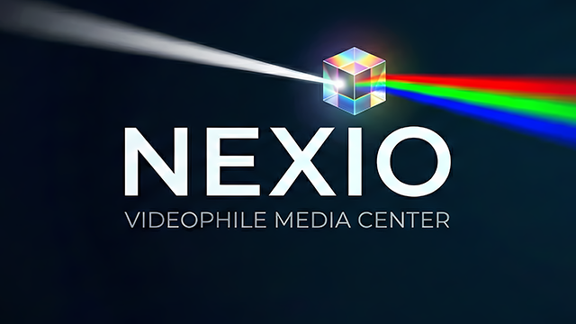

<div align="center">

  
  <br />
  <br />

  [![Contributors][contributors-shield]][contributors-url]
  [![Forks][forks-shield]][forks-url]
  [![Stargazers][stars-shield]][stars-url]
  [![Issues][issues-shield]][issues-url]
  [![License][license-shield]][license-url]

  <p>
    A modern Android TV media player powered by the Stremio addon ecosystem.
    <br />
    Stremio Addon ecosystem • Android TV optimized • Playback-focused experience
  </p>

</div>

## About

NEXIO is a modern media player designed specifically for Android TV.

It acts as a client-side playback interface that can integrate with the Stremio addon ecosystem for content discovery and source resolution through user-installed extensions.

Built with Kotlin and optimized for a TV-first viewing experience.

## Installation

### Android TV

Download the latest APK from [GitHub Releases](https://github.com/johnneerdael/NEXIO/releases/latest) and install on your Android TV device.

## Development

### Prerequisites

- Android Studio (latest version)
- JDK 11+
- Android SDK (API 29+)
- Gradle 8.0+

### Setup

```bash
git clone https://github.com/johnneerdael/NEXIO.git
cd NEXIO
./gradlew build
```

### Running on Emulator or Device

```bash
# Debug build
./gradlew installDebug

# Run on connected device
adb shell am start -n com.nuvio.tv/.MainActivity
```

## Legal & DMCA

NEXIO functions solely as a client-side interface for browsing metadata and playing media provided by user-installed extensions and/or user-provided sources. It is intended for content the user owns or is otherwise authorized to access.

NEXIO is not affiliated with any third-party extensions or content providers. It does not host, store, or distribute any media content.

For comprehensive legal information, including our full disclaimer, third-party extension policy, and DMCA/Copyright information, please visit our **[Legal & Disclaimer Page](https://johnneerdael.github.io/NEXIO/#legal)**.

## Built With

* Kotlin
* Jetpack Compose & TV Material3
* ExoPlayer / Media3
* Hilt (Dependency Injection)
* Retrofit (Networking)
* Gradle

## Star History

<a href="https://www.star-history.com/#johnneerdael/NEXIO&type=date&legend=top-left">
 <picture>
   <source media="(prefers-color-scheme: dark)" srcset="https://api.star-history.com/svg?repos=johnneerdael/NEXIO&type=date&theme=dark&legend=top-left" />
   <source media="(prefers-color-scheme: light)" srcset="https://api.star-history.com/svg?repos=johnneerdael/NEXIO&type=date&legend=top-left" />
   
 </picture>
</a>

<!-- MARKDOWN LINKS & IMAGES -->
[contributors-shield]: https://img.shields.io/github/contributors/johnneerdael/NEXIO.svg?style=for-the-badge
[contributors-url]: https://github.com/johnneerdael/NEXIO/graphs/contributors
[forks-shield]: https://img.shields.io/github/forks/johnneerdael/NEXIO.svg?style=for-the-badge
[forks-url]: https://github.com/johnneerdael/NEXIO/network/members
[stars-shield]: https://img.shields.io/github/stars/johnneerdael/NEXIO.svg?style=for-the-badge
[stars-url]: https://github.com/johnneerdael/NEXIO/stargazers
[issues-shield]: https://img.shields.io/github/issues/johnneerdael/NEXIO.svg?style=for-the-badge
[issues-url]: https://github.com/johnneerdael/NEXIO/issues
[license-shield]: https://img.shields.io/github/license/johnneerdael/NEXIO.svg?style=for-the-badge
[license-url]: http://www.gnu.org/licenses/gpl-3.0.en.html
