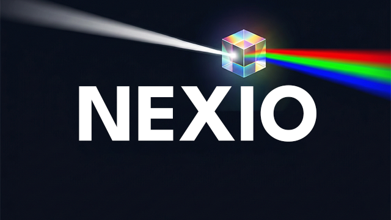

  

# NEXIO

NEXIO is a streaming app for Android TV and Fire TV built around a simple idea:
the living-room experience should feel premium before, during, and after playback.

It is not just another app that opens a stream list. Nexio combines a TV-first
interface, account-backed setup, debrid-aware playback, richer metadata,
multi-tracker watch state, and a companion web portal so the same setup can move
cleanly across devices.

## Install

The easiest way to install Nexio on Android TV or Fire TV is with
**Downloader by AFTVNews**.

  
  

Enter one of these Downloader codes:

| Channel | Downloader code | Direct download |
| --- | ---: | --- |
| Release | `3316080` | [download.nexioapp.org/release](https://download.nexioapp.org/release) |
| Early Access | `7063421` | [download.nexioapp.org/pre-release](https://download.nexioapp.org/pre-release) |

Early Access receives newer features sooner. Release is the steadier channel for
most users.

## What Nexio Is For

Nexio is for people who want the convenience of a modern streaming interface
without giving up control over the things that actually determine playback
quality: source cleanup, debrid behavior, device capability, metadata quality,
watch-state sync, subtitles, and home-screen organization.

Where addon-first or app-only setups like Stremio and NuvioTV can become a pile
of addons, names, and manual choices, Nexio tries to turn that setup into a
managed ecosystem: configure it once, sync it through your account, and let the
TV app do more of the work when you sit down to watch.

## Why It Feels Different

### Smarter Playback Choices

Nexio's Deterministic Autoplay is built for lean-back watching. Instead of only
showing a long stream list and making you compare every result by hand, Nexio can
score candidates using your measured setup, device capabilities, HDR support,
audio path, transport behavior, and stream quality signals.

That matters most with high-quality files, remuxes, Dolby Vision variants, and
home theater devices where the best result on paper is not always the best result
on your screen.

### Debrid Is Part Of The Product

Nexio supports Real-Debrid, Premiumize, TorBox, and EasyDebrid as product
integrations, not just credential boxes. They power direct link resolution,
cached availability checks, Service Wrap, debrid-aware library behavior, and
benchmark-informed playback decisions.

Recent Early Access builds also add TorBox direct-play library support with
device-code QR pairing, making debrid libraries feel closer to a first-class TV
surface.

### One Setup, Many Screens

The Nexio web portal is the control plane for your setup. Use it to manage
addons, integrations, catalog ordering, formatter choices, account settings, and
device linking, then let linked TVs receive the configuration automatically.

That is the practical difference from app-only setups: you are not rebuilding the
same configuration on every device or hiding important controls behind a TV
remote.

### Watch State That Matches Real Use

Nexio treats tracking as a core layer. Trakt and Simkl can both contribute to
Continue Watching, Up Next, watched state, and scrobbling. Current Early Access
builds merge Trakt and Simkl progress, dedupe duplicates, and fan out scrobbles
to every authenticated tracker.

For anime users, Simkl-first tracking and dedicated anime addon support are part
of the direction, not an afterthought.

### A Better Home Screen

Modern Home is designed to feel curated instead of dumped together. Nexio can
combine addon catalogs, Trakt lists, MDBList sources, library state, posters,
ratings, trailers, and Continue Watching into a richer TV surface.

You can also shape that surface from the portal by choosing which catalogs matter
and how they should be ordered.

### Metadata And Artwork With Real Depth

Nexio enriches raw addon results with providers such as TMDB, TVDB, MDBList,
OMDb/IMDb-style ratings, RPDB, and TOP Posters. The result is a more polished
detail experience: better posters, stronger TV metadata, episode context,
ratings, trailers, cast, collections, and recommendation surfaces.

Built-in metadata access is provided for normal non-commercial app usage, and
users can optionally bring their own provider keys for their own quota.

### Subtitles Built For International Watching

Nexio supports parallel subtitle fetching, Wyzie subtitles, libass rendering for
ASS/SSA, and AI subtitle translation. For ASS/SSA subtitles, the translation path
preserves structure so positioning, styling, movement, drawing, and karaoke
behavior are not flattened into generic text cues.

This is especially useful for anime and international content where "subtitle
support" needs to mean more than finding a plain SRT file.

### Playback Tuning For Enthusiasts

Nexio includes practical playback controls for demanding setups: debrid
benchmarking, direct vs optimized transport comparison, chunk and connection
tuning, disk-backed VOD cache, frame-rate matching, resolution matching, Dolby
Vision handling, and advanced passthrough work.

TrueHD should not be treated as fully reliable or production-stable today, but
the broader audio and video path is being built for users who care about AVRs,
soundbars, HDR displays, and device-specific behavior.

## Getting Started

The best first setup is:

1. Install Nexio with Downloader.
2. Create a Nexio account and link your TV.
3. Add your debrid provider.
4. Connect Trakt and/or Simkl.
5. Configure addons and parser behavior.
6. Tune Autoplay, subtitles, and caching once the basics work.

The public setup guide is being built around this order so new users can get from
install to a usable living-room setup without guessing which setting matters
first.

Useful links:

- [Latest GitHub releases](https://github.com/johnneerdael/nexio/releases)
- [Release download](https://download.nexioapp.org/release)
- [Early Access download](https://download.nexioapp.org/pre-release)

## Legal

NEXIO is a client application. It does not host or distribute media content.
Media access depends on user-installed addons, services, and sources the user is
authorized to use.
