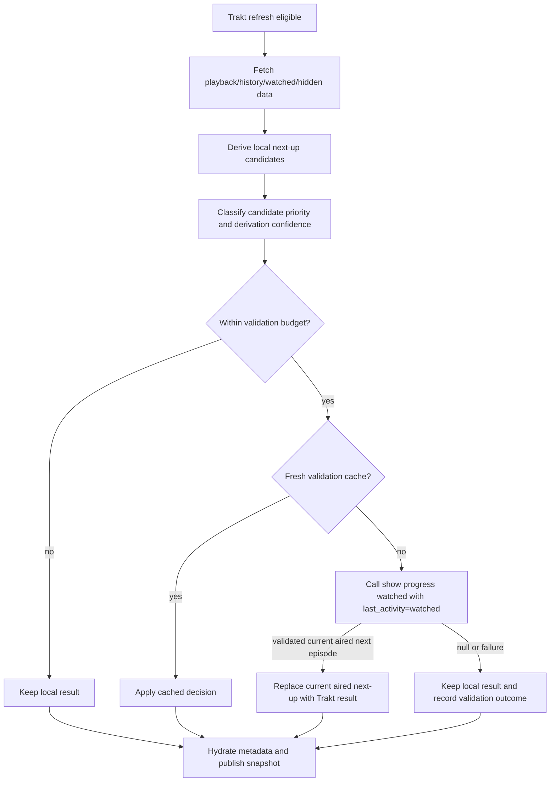

# feat: Validate Continue Watching next-up candidates

## Overview

Improve Trakt-backed Continue Watching next-up accuracy by keeping Nexio's local derivation as the default and escalating only high-risk candidates to Trakt show-progress validation. The change should correct visible wrong-next-up cases without returning to the old unbounded per-show `progress/watched` fetch path.

## Problem Frame

Trakt does not expose a single continue-watching feed. Nexio currently composes one from playback progress, recent episode history, watched-show context, hidden progress, local/addon metadata, and persisted snapshots. That keeps Home responsive and avoids large API bursts, but next-up can be wrong when local metadata is incomplete, local ordering differs from Trakt's aired-progress semantics, or a recent mutation makes the derived candidate stale (see origin: docs/brainstorms/2026-04-14-continue-watching-next-up-quality-requirements.md).

## Requirements Trace

- R1. Prefer resume entries over next-up entries for shows with active paused or partially watched episodes.
- R2. Validate next-up candidates with Trakt when local derivation is ambiguous, stale, or mutation-affected.
- R3. Use bounded escalation: local derivation by default; Trakt show-progress validation only for high-priority candidates.
- R4. Define high priority by user-visible risk: likely visible range, recent activity, mutation effects, stale validation, or weak fallback.
- R5. When validation and local metadata disagree about the current aired next episode, Trakt validation wins; local metadata remains display enrichment.
- R6. Preserve hidden/dropped show and hidden season behavior through validation.
- R7. Bound validation with a per-refresh request budget.
- R8. Cache validation results with explicit freshness and one-shot mutation bypass.
- R9. Keep the best local result if validation fails or is throttled.
- R10. Preserve the mixed resume/next-up activity timeline.
- R11. Continue Watching next-up rows must exclude unaired future episodes and should not expose a user toggle; TV detail may continue showing unaired future episodes.
- R12. Add decision visibility for debugging wrong-next-up reports.

## Scope Boundaries

- Do not build or assume a nonexistent Trakt continue-watching endpoint.
- Do not use watchlist as an active watching source; `trakt.apib` directs apps toward watched and show-progress APIs for active watching semantics.
- Do not validate every watched show on every refresh.
- Do not redesign Continue Watching artwork, TMDB enrichment, or unrelated Home rows.
- Do not change TV detail behavior for unaired future episodes; the no-unaired rule applies to Continue Watching.
- Do not change Simkl next-up behavior except where shared types need to remain compatible.

## Context & Research

### Relevant Code and Patterns

- `app/src/main/java/com/nexio/tv/data/repository/TraktProgressService.kt` owns Trakt progress refreshes, activity fingerprints, playback/history fetching, hidden progress, metadata hydration, and current local next-up derivation.
- `app/src/main/java/com/nexio/tv/data/repository/ContinueWatchingSnapshotService.kt` builds and persists the raw Continue Watching snapshot, filters dismissed next-up entries, gates air dates, and schedules re-emits for future items.
- `app/src/main/java/com/nexio/tv/data/repository/ContinueWatchingTimeline.kt` merges resume and next-up rows while keeping resume priority and near-equal activity clustering.
- `app/src/main/java/com/nexio/tv/data/repository/AirDateGate.kt` centralizes aired-vs-future gating and already has focused tests.
- `app/src/main/java/com/nexio/tv/data/local/TraktSettingsDataStore.kt` exposes `showUnairedNextUp`; local research found the setting in Trakt settings UI, account settings sync models, and tests. This setting should be removed because Continue Watching should always exclude unaired future episodes.
- `app/src/main/java/com/nexio/tv/data/remote/api/TraktApi.kt` already exposes `getShowProgressWatched(..., lastActivity)`.
- `app/src/main/java/com/nexio/tv/data/remote/dto/trakt/TraktSyncDtos.kt` already models `TraktShowProgressResponseDto.nextEpisode`.
- Existing tests to mirror: `app/src/test/java/com/nexio/tv/data/repository/ContinueWatchingTimelineTest.kt`, `app/src/test/java/com/nexio/tv/data/repository/AirDateGateTest.kt`, and `app/src/test/java/com/nexio/tv/data/repository/TraktProgressServiceOptimisticRemovalTest.kt`.

### Institutional Learnings

- No `docs/solutions/` directory exists in this checkout, so no reusable institutional learning was found for this planning pass.

### External References

- External web research was skipped. `trakt.apib` is checked into the repo and is the local API contract source for this feature.
- `trakt.apib` documents `/sync/playback/{type}`, `/sync/watched/{type}`, `/shows/{id}/progress/watched`, `/users/hidden/{section}`, and `/sync/last_activities`.
- `trakt.apib` documents that watchlist should not be used as an actively-watching source.
- `trakt.apib` documents that show watched progress uses only aired episodes for progress calculations, which matches the Continue Watching rule to exclude unaired future episodes.

## Key Technical Decisions

- Use a hybrid validator inside the Trakt progress pipeline: derive locally first, then validate a bounded set of high-risk candidates before publishing `myShowsNextUp` and `myShowsNextUpAll`.
- Resolve planning defaults as initial constants: inspect the top 20 derived candidates for visibility risk, validate at most 5 shows per refresh, run at most 2 validations concurrently, cache positive results for 10 minutes, and cache negative/error results for 5 minutes.
- Treat mutation invalidation as a one-shot cache bypass for the affected show. Existing calls to invalidate show next-up state should also make the next validation eligible without forcing a global full-validation refresh.
- Use Trakt `progress/watched` with `last_activity=watched` for validation. It should settle the current aired next episode only. Remove the `showUnairedNextUp` toggle and make Continue Watching aired-only; do not apply that policy to TV detail.
- Keep decision visibility log-only for this feature. Use existing `trace(...)` style in `TraktProgressService` rather than adding UI or persisted debug state.

## Open Questions

### Resolved During Planning

- Visible candidate budget: start with 20 derived next-up candidates.
- Validation budget: start with 5 show-progress validations per refresh and concurrency 2.
- Cache TTLs: start with 10 minutes for positive validation and 5 minutes for negative/error validation.
- Debug visibility: use log-only decision traces under the existing Trakt progress service debug logging pattern.

### Deferred to Implementation

- Exact helper and data class names: choose names that fit `TraktProgressService.kt` after editing.
- Whether to repurpose `showNextUpState` or introduce a separate validation cache: prefer reuse if it stays clear, but do not force the existing shape if it obscures validation semantics.
- Exact cache key normalization: implementation should verify whether canonical content ID, Trakt show ID, or path ID produces the least duplication in the existing code.

## High-Level Technical Design

> *This illustrates the intended approach and is directional guidance for review, not implementation specification. The implementing agent should treat it as context, not code to reproduce.*

## Implementation Units

- [ ] **Unit 1: Model next-up derivation confidence and validation priority**

**Goal:** Make local next-up derivation report enough information to decide whether Trakt validation is warranted.

**Requirements:** R2, R3, R4, R7, R12

**Dependencies:** None

**Files:**
- Modify: `app/src/main/java/com/nexio/tv/data/repository/TraktProgressService.kt`
- Test: `app/src/test/java/com/nexio/tv/data/repository/TraktProgressServiceNextUpValidationTest.kt`

**Approach:**
- Refine the local next-up derivation path so it distinguishes strong metadata-based resolution from weak fallbacks such as missing metadata or `episode + 1`.
- Define high-priority eligibility with concrete inputs: visible candidate rank, recent activity, mutation/stale validation marker, and weak derivation fallback.
- Keep the prioritization internal to Trakt next-up derivation so snapshot/timeline code continues receiving ordinary `NextUpEntry` values.
- Add trace points for local-derived, weak-fallback, skipped-budget, and validation-eligible decisions.

**Execution note:** Add characterization tests around the existing local derivation behavior before changing the derivation return shape.

**Patterns to follow:**
- Existing private cache/data classes in `TraktProgressService.kt`.
- Existing focused repository tests in `app/src/test/java/com/nexio/tv/data/repository/ContinueWatchingTimelineTest.kt`.

**Test scenarios:**
- Happy path: metadata contains the watched seed and later episode -> candidate is strong and not validation-required unless visible/recent policy selects it.
- Edge case: metadata is missing for a recently active visible show -> candidate is weak/high-priority and eligible for validation.
- Edge case: metadata is unavailable and the candidate would otherwise fall back to `episode + 1` -> candidate is weak/high-priority.
- Edge case: candidate is outside the visible window and not recent/stale/mutation-affected -> candidate is not selected for validation.
- Integration: derivation still returns sorted `NextUpEntry` output compatible with downstream snapshot publication.

**Verification:**
- Local derivation confidence is explicit and tested.
- High-priority selection is deterministic and budgetable before any network call happens.

- [ ] **Unit 2: Add bounded Trakt show-progress validation and cache**

**Goal:** Validate high-priority next-up candidates against Trakt show progress without unbounded API calls.

**Requirements:** R2, R3, R5, R7, R8, R9, R11, R12

**Dependencies:** Unit 1

**Files:**
- Modify: `app/src/main/java/com/nexio/tv/data/repository/TraktProgressService.kt`
- Modify if needed: `app/src/main/java/com/nexio/tv/data/remote/dto/trakt/TraktSyncDtos.kt`
- Test: `app/src/test/java/com/nexio/tv/data/repository/TraktProgressServiceNextUpValidationTest.kt`

**Approach:**
- Add a validation helper that calls `getShowProgressWatched` with `lastActivity = "watched"` for eligible candidates.
- Cache positive, negative, and error outcomes using the planning defaults. Mutation invalidation should allow one bypass for the affected show.
- When Trakt returns `next_episode`, map it to a `NextUpEntry` using the local candidate/show context for fields Trakt does not provide, such as existing artwork and activity timestamp fallback.
- If Trakt returns no current aired `next_episode`, do not substitute an unaired local Continue Watching candidate; keep the previous local result only when it is aired, otherwise omit that next-up candidate until it airs.
- If validation fails, is throttled, or returns an unusable response, keep the best aired local candidate and record a trace reason.

**Patterns to follow:**
- Existing `getPlayback`, `getWatchedMoviesSnapshot`, and hidden-progress cache/throttle patterns in `TraktProgressService.kt`.
- Existing `TraktShowProgressResponseDto` and `TraktEpisodeDto` DTO shapes in `TraktSyncDtos.kt`.

**Test scenarios:**
- Happy path: local candidate says S1E4, Trakt validation says S1E5 -> published candidate uses S1E5 for the current aired next episode.
- Happy path: local candidate and Trakt candidate match -> result is stable and cache is populated.
- Edge case: Trakt returns `next_episode = null` while local candidate is future/unaired -> Continue Watching omits that next-up candidate, while TV detail remains out of scope.
- Error path: Trakt API request fails or returns an unusable body -> best aired local candidate remains and negative/error cache prevents immediate retry loops.
- Edge case: cached positive validation is reused within TTL and avoids another API call.
- Edge case: mutation invalidation bypasses a fresh cache once for that show.
- Integration: per-refresh validation count never exceeds the configured budget and concurrency does not exceed the configured limit.

**Verification:**
- Validation can correct visible wrong current-aired next-up selections.
- Validation cannot blank the feed or cause unbounded Trakt requests.

- [ ] **Unit 3: Integrate validation and remove the unaired CW toggle**

**Goal:** Ensure validated candidates are what Continue Watching snapshots and Home UI observe, while preserving existing resume, hidden, dropped, and air-date behavior.

**Requirements:** R1, R5, R6, R9, R10, R11

**Dependencies:** Unit 2

**Files:**
- Modify: `app/src/main/java/com/nexio/tv/data/repository/TraktProgressService.kt`
- Modify only if needed: `app/src/main/java/com/nexio/tv/data/repository/ContinueWatchingSnapshotService.kt`
- Modify: `app/src/main/java/com/nexio/tv/data/local/TraktSettingsDataStore.kt`
- Modify: `app/src/main/java/com/nexio/tv/ui/screens/settings/TraktViewModel.kt`
- Modify: `app/src/main/java/com/nexio/tv/ui/screens/settings/TraktSettingsContent.kt`
- Modify: `app/src/main/java/com/nexio/tv/ui/screens/settings/TraktScreen.kt`
- Modify: `app/src/main/java/com/nexio/tv/data/remote/supabase/AccountSyncModels.kt`
- Modify: `app/src/main/java/com/nexio/tv/core/sync/AccountSettingsSyncService.kt`
- Test: `app/src/test/java/com/nexio/tv/data/repository/TraktProgressServiceNextUpValidationTest.kt`
- Test if snapshot behavior changes: `app/src/test/java/com/nexio/tv/data/repository/ContinueWatchingTimelineTest.kt`
- Test: `app/src/test/java/com/nexio/tv/data/repository/ContinueWatchingTimelineAirDateTest.kt`
- Test: `app/src/test/java/com/nexio/tv/ui/screens/settings/CatalogSelectionPersistenceTest.kt`
- Test: `app/src/test/java/com/nexio/tv/ui/screens/settings/TraktViewModelPriorityHydrationTest.kt`
- Test if account sync contract changes: `app/src/test/java/com/nexio/tv/core/sync/AccountConfigSyncContractTest.kt`

**Approach:**
- Run validation after local next-up derivation and hidden/dropped filtering, but before `hydrateMetadata(...)` and before updating `myShowsNextUp`/`myShowsNextUpAll`.
- Keep `ContinueWatchingSnapshotService` filtering as the final guard for dismissals and air-date gating.
- Remove the `showUnairedNextUp` setting from Trakt settings UI and account settings sync because Continue Watching should always be aired-only.
- Preserve TV detail unaired behavior by avoiding changes to detail/player next-episode logic outside the Continue Watching path.
- Preserve resume suppression by not changing `splitNextUpCandidatesForContinueWatching(...)` or `buildMixedContinueWatchingTimeline(...)` unless tests reveal a required compatibility change.
- Avoid changing Simkl data flow; validation is Trakt-specific and should not alter `TrackingProgressService` provider parity beyond existing mapping.

**Patterns to follow:**
- Current `refreshRemoteSnapshot()` sequencing in `TraktProgressService.kt`.
- Current mixed timeline tests in `ContinueWatchingTimelineTest.kt`.
- Current `AirDateGate` tests for future item behavior.

**Test scenarios:**
- Integration: a validated Trakt next-up row flows through `myShowsNextUp` and remains ordered by activity in the mixed timeline.
- Integration: active paused episode for the same show still suppresses the next-up entry from the main feed.
- Edge case: hidden show, dropped show, or hidden season stays suppressed even if validation could produce a next episode.
- Edge case: future/unaired local entry is excluded from Continue Watching after validation returns no current aired next episode.
- Error path: validation failure leaves prior local snapshot behavior unchanged.

**Verification:**
- Existing Continue Watching ordering and resume-priority behavior stay intact.
- Only Trakt next-up selection changes where validation provides a better current aired answer.

- [ ] **Unit 4: Add decision visibility for validation outcomes**

**Goal:** Make wrong-next-up debugging possible without adding a new UI surface or persisted debug model.

**Requirements:** R12, R9

**Dependencies:** Units 1-3

**Files:**
- Modify: `app/src/main/java/com/nexio/tv/data/repository/TraktProgressService.kt`
- Test: `app/src/test/java/com/nexio/tv/data/repository/TraktProgressServiceNextUpValidationTest.kt`

**Approach:**
- Use the existing `trace(...)` pattern for compact decision messages.
- Cover the important decision states: local-strong, local-weak, validation-eligible, budget-skipped, cache-hit, validation-success, validation-null, validation-error, hidden/dropped suppression, and future-unaired-suppressed.
- Keep log content token-safe and user-data-light: content IDs and season/episode are acceptable, but avoid dumping full API bodies.

**Patterns to follow:**
- Existing debug logging in `TraktProgressService.kt`, including `trace(...)` and `BuildConfig.DEBUG` gating.

**Test scenarios:**
- Happy path: validation success records a traceable decision state through the validator result type, even if the log call itself is not asserted.
- Error path: validation failure records a distinct validator outcome and keeps local candidate.
- Edge case: budget-skipped candidate records a distinct outcome from cache-hit and validation-error.

**Verification:**
- Engineers investigating a wrong next-up report can tell whether a show was locally derived, validated, skipped, cached, or suppressed.

- [ ] **Unit 5: Regression coverage and documentation touch-up**

**Goal:** Lock in the intended behavior and update docs only if the user-facing behavior needs clarification.

**Requirements:** R1-R12

**Dependencies:** Units 1-4

**Files:**
- Modify: `app/src/test/java/com/nexio/tv/data/repository/TraktProgressServiceNextUpValidationTest.kt`
- Modify if needed: `app/src/test/java/com/nexio/tv/data/repository/ContinueWatchingTimelineTest.kt`
- Modify if needed: `app/src/test/java/com/nexio/tv/data/repository/AirDateGateTest.kt`
- Modify if needed: `docs-site/watch/home-and-continue-watching.md`

**Approach:**
- Keep primary coverage in unit tests around the validator and derivation behavior.
- Add snapshot/timeline tests only if integration changes cross into those functions.
- Update `docs-site/watch/home-and-continue-watching.md` only if the implementation changes visible behavior or troubleshooting language beyond the current mixed Trakt data explanation.

**Patterns to follow:**
- Existing test naming style with descriptive backtick test names.
- Existing `docs-site/watch/home-and-continue-watching.md` product-facing tone.

**Test scenarios:**
- Integration: visible high-priority wrong local next-up is corrected by validation.
- Integration: large candidate list validates only within budget and preserves unvalidated local candidates.
- Edge case: mutation-affected candidate bypasses cache once, then returns to normal cache behavior.
- Edge case: Trakt null next episode removes or withholds an unaired Continue Watching candidate, without changing TV detail behavior.
- Error path: validation failure preserves local candidate and caches the failure briefly.
- Regression: resume-over-next-up behavior remains unchanged.

**Verification:**
- The behavior described in the requirements is covered by focused tests.
- Any documentation change matches actual behavior and does not imply a nonexistent Trakt continue-watching feed.

## System-Wide Impact

- **Interaction graph:** Trakt refresh -> local progress/history derivation -> bounded validation -> metadata hydration -> snapshot service -> Home view model -> mixed timeline UI.
- **Error propagation:** Validation failures should become local fallback outcomes, not thrown refresh failures that blank `myShowsNextUp`.
- **State lifecycle risks:** Validation cache, hidden/dropped cache, optimistic progress, and snapshot persistence must not contradict each other after mutation invalidation.
- **API surface parity:** The Trakt settings UI and account settings sync contract change because `showUnairedNextUp` is removed. Simkl behavior should remain unchanged.
- **Integration coverage:** The cross-layer behavior to prove is that validated candidates flow into the same snapshot/timeline path while preserving resume suppression and air-date gating.
- **Unchanged invariants:** Continue Watching remains a mixed activity timeline; watchlist remains out of scope; Trakt show-progress validation is bounded and optional, not global.

## Risks & Dependencies

| Risk | Mitigation |
|------|------------|
| Validation reintroduces Trakt rate-limit pressure | Enforce per-refresh budget, concurrency, and TTLs in the validator tests. |
| Trakt omits future episodes and TV detail still needs future episode visibility | Treat the no-unaired rule as Continue Watching-only; do not change detail/player next-episode behavior. |
| Local and Trakt IDs do not normalize to the same show | Use existing ID normalization/path ID helpers and test canonical-key behavior. |
| Hidden/dropped shows reappear through validation | Run validation only after hidden/dropped context is available and keep snapshot service filtering as a final guard. |
| Cache staleness causes a recently watched show to stay wrong | Mark mutation-affected shows as cache-bypass eligible once and use last-activities fingerprints to invalidate stale state. |

## Documentation / Operational Notes

- Update user-facing Trakt/Home docs if they mention the unaired Continue Watching toggle or imply users can show unaired episodes in Continue Watching.
- Keep wording aligned with `trakt.apib`: Trakt supplies building blocks, not a continue-watching feed.
- No rollout flag is planned; bounded budgets and fallback behavior are the safety mechanism.

## Sources & References

- **Origin document:** [docs/brainstorms/2026-04-14-continue-watching-next-up-quality-requirements.md](docs/brainstorms/2026-04-14-continue-watching-next-up-quality-requirements.md)
- API blueprint: [trakt.apib](trakt.apib)
- Current Trakt progress pipeline: [app/src/main/java/com/nexio/tv/data/repository/TraktProgressService.kt](app/src/main/java/com/nexio/tv/data/repository/TraktProgressService.kt)
- Snapshot pipeline: [app/src/main/java/com/nexio/tv/data/repository/ContinueWatchingSnapshotService.kt](app/src/main/java/com/nexio/tv/data/repository/ContinueWatchingSnapshotService.kt)
- Timeline helper: [app/src/main/java/com/nexio/tv/data/repository/ContinueWatchingTimeline.kt](app/src/main/java/com/nexio/tv/data/repository/ContinueWatchingTimeline.kt)
- Air-date helper: [app/src/main/java/com/nexio/tv/data/repository/AirDateGate.kt](app/src/main/java/com/nexio/tv/data/repository/AirDateGate.kt)
- Existing timeline tests: [app/src/test/java/com/nexio/tv/data/repository/ContinueWatchingTimelineTest.kt](app/src/test/java/com/nexio/tv/data/repository/ContinueWatchingTimelineTest.kt)
