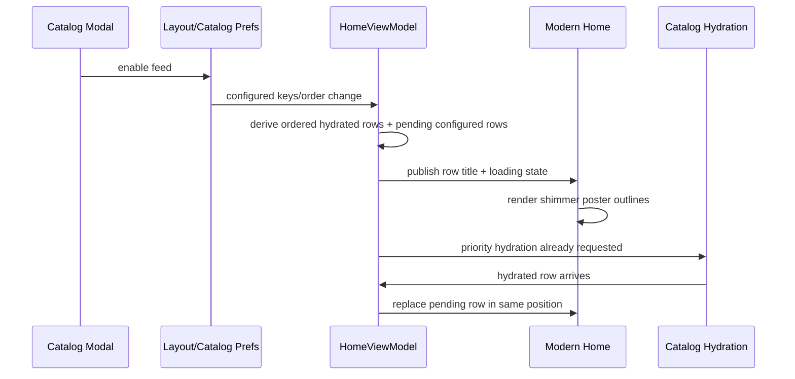

# feat: Show Pending Catalog Rows On Modern Home

## Overview

Modern Home should reflect catalog configuration immediately. When a catalog feed is enabled but its titles or poster assets are not hydrated yet, Modern Home should show the row in the configured position with the correct title and a small set of non-interactive, lightly pulsating poster outlines. Once hydration completes, the placeholder row should be replaced by the real hydrated row without changing row order.

## Problem Frame

The current modern home pipeline only displays catalog rows that already have items. This makes enabled feeds invisible until hydration finishes, so users cannot tell whether the modal change applied, what row order will settle to, or whether the app is still working. The previous visibility fix made removals apply promptly; this plan extends the same immediacy to additions by representing pending configured rows in the home state and rendering them as loading placeholders.

## Requirements Trace

- R1. Enabling a catalog from the catalog modal makes Modern Home show a row immediately, before hydrated titles/posters exist.
- R2. Pending rows use the correct catalog title and appear in the same order defined by catalog configuration.
- R3. Pending rows render empty poster outlines with a subtle loading pulse/shimmer instead of interactive content cards.
- R4. Hydrated data replaces the pending row when available, without duplicate rows or row-order jumps.
- R5. Disabled/removed catalogs remain absent immediately and should not leave loading placeholders behind.
- R6. Placeholder rows must not trigger item focus, hero trailer autoplay, navigation, long-press actions, watched-state checks, poster prefetch, or load-more calls.
- R7. Loading-only rows are transient UI state and must never be persisted as completed home snapshots or counted as hydrated source-cache completeness.
- R8. Pending rows must derive titles from a deterministic source hierarchy so built-in, addon, Trakt custom-list, MDBList, and fallback rows show user-meaningful titles before item hydration.

## Scope Boundaries

- This does not change catalog hydration APIs, provider fetch behavior, or sync semantics.
- This does not add placeholders to Classic or Grid home unless implementation reveals a shared helper that can stay invisible outside Modern Home.
- This does not invent placeholder item titles; only the row title is meaningful while items are unavailable.
- This does not change Android TV recommendation feed behavior.

## Context & Research

### Relevant Code and Patterns

- `app/src/main/java/com/nexio/tv/ui/screens/home/HomeViewModelCatalogPipeline.kt` builds combined live and synthetic catalog rows, restores snapshots, filters disabled rows, and computes ordered home output.
- `app/src/main/java/com/nexio/tv/ui/screens/home/HomeViewModelCatalogUtils.kt` owns configured order-key helpers and disabled-key matching for addon and synthetic catalogs.
- `app/src/main/java/com/nexio/tv/ui/screens/home/HomeScreen.kt` decides whether Home has renderable content before routing to Modern Home; today it only counts catalog rows with real items.
- `app/src/main/java/com/nexio/tv/ui/screens/home/ModernHomeContent.kt` currently derives `visibleCatalogRows` by filtering to rows with non-empty `items`, which hides configured-but-not-hydrated rows.
- `app/src/main/java/com/nexio/tv/ui/screens/home/ModernHomeRows.kt` renders `HeroCarouselRow` items and already carries row-level `isLoading`, but empty rows do not reach rendering today.
- `app/src/main/java/com/nexio/tv/ui/components/Skeletons.kt` provides `rememberShimmerBrush()` and existing skeleton visual language that can be reused for the pulsating poster outlines.
- `app/src/test/java/com/nexio/tv/ui/screens/home/HomeCatalogStartupReadinessTest.kt` is the right home-order utility test target.
- `app/src/test/java/com/nexio/tv/ui/screens/home/ModernHomeModelsTest.kt` is the right target for pure modern-row/model helper coverage.
- `app/src/test/java/com/nexio/tv/ui/screens/addon/CatalogOrderViewModelTest.kt` covers modal-triggered hydration notification behavior from the previous change.

### Institutional Learnings

- No `docs/solutions/` directory exists in this checkout, so there are no stored institutional solution docs to apply.

### External References

- External research skipped. This work follows local Kotlin/Compose patterns and does not introduce new framework behavior.

## Key Technical Decisions

- Represent pending rows in the home data pipeline, not only in the composable layer: Modern Home needs correct order, titles, snapshot filtering, and replacement behavior from the same source of truth as hydrated rows.
- Treat pending rows as row-level loading state, not fake `MetaPreview` items: placeholders are visual affordances and must not participate in focus, navigation, trailer, metadata, watched-state, or poster-prefetch logic.
- Reuse the existing skeleton shimmer palette: it keeps the loading UI consistent with the app and avoids creating a second loading style.
- Keep placeholder behavior Modern-only at render time: the pipeline may carry loading rows, but Classic/Grid should continue filtering empty rows unless explicitly changed later.
- Derive pending-row titles from the best available catalog metadata instead of raw keys. Preferred order: existing hydrated row title when replacing cached data, addon `CatalogDescriptor.name`, provider option/list title for Trakt and MDBList custom feeds, static built-in label for Trakt/SIMKL built-ins, then a humanized canonical key as a last-resort fallback.

## Open Questions

### Resolved During Planning

- Should pending rows be interactive? No. They should communicate layout and loading only; there is no item-level content to navigate to.
- Should disabled rows still disappear immediately? Yes. Disabled configured rows must be excluded before placeholders are built or rendered.
- Should loading rows preserve configured order? Yes. The configured order is the primary value of this change.

### Deferred to Implementation

- Exact placeholder count: choose a value that fits the modern row density after seeing the row spacing in code. Start with a small fixed count such as 8-10.
- Exact animation implementation: use existing shimmer or a simple alpha pulse, whichever best matches current Compose utilities with minimal new surface.

## High-Level Technical Design

> *This illustrates the intended approach and is directional guidance for review, not implementation specification. The implementing agent should treat it as context, not code to reproduce.*

## Implementation Units

- [ ] **Unit 1: Derive Pending Configured Rows**

**Goal:** Make the home pipeline output pending catalog rows for enabled configured feeds that do not yet have hydrated rows.

**Requirements:** R1, R2, R4, R5, R7, R8

**Dependencies:** None

**Files:**
- Modify: `app/src/main/java/com/nexio/tv/ui/screens/home/HomeViewModelCatalogUtils.kt`
- Modify: `app/src/main/java/com/nexio/tv/ui/screens/home/HomeViewModelCatalogPipeline.kt`
- Test: `app/src/test/java/com/nexio/tv/ui/screens/home/HomeCatalogStartupReadinessTest.kt`

**Approach:**
- Add or extend a helper that returns configured home row descriptors, not just order keys. Each descriptor should include order key, addon/source identity, catalog id, type, display title, and disabled state.
- Build descriptors for addon catalogs, Trakt built-ins/custom lists, SIMKL built-ins, and MDBList lists from existing catalog settings and discovery metadata.
- Use this title source hierarchy for descriptors: existing hydrated row title if available, addon catalog descriptor name, Trakt/MDBList option title from discovery metadata, static built-in provider labels, and finally a humanized canonical key. Do not show raw order keys unless no better metadata exists.
- During `updateCatalogRowsPipeline`, merge hydrated rows with pending descriptors in configured order. If a hydrated row exists, use it. If it does not and the descriptor is enabled, create a row-level loading representation with correct title and empty items.
- Exclude disabled descriptors before pending rows are created so removals stay immediate and cannot produce loading ghosts.
- Adjust disk-first startup completeness gating so pending configured rows may be published as transient UI even when a hydrated snapshot is not yet complete. Do not let pending rows mark source caches complete.
- Keep pending rows out of `persistAndApplyHomeSnapshotPipeline` and snapshot writes. If the effective display list mixes hydrated and loading rows, persist only the hydrated rows or skip persistence for that computation; never serialize loading-only rows as a completed `HomeCatalogSnapshotStore.Snapshot`.

**Execution note:** Implement test-first around configured order and disabled-key behavior before changing row construction.

**Patterns to follow:**
- `buildExpectedConfiguredHomeOrderKeys` and `buildPublishableConfiguredHomeOrderKeys` in `HomeViewModelCatalogUtils.kt`
- Synthetic row builders in `HomeViewModelCatalogPipeline.kt`
- Disabled synthetic row filtering added in the prior catalog visibility fix

**Test scenarios:**
- Happy path: given enabled Trakt, SIMKL, MDBList, and addon catalogs with no hydrated rows, deriving configured rows returns descriptors in the configured order with correct titles.
- Happy path: descriptor title derivation uses addon catalog names, Trakt/MDBList option titles, and SIMKL/Trakt built-in labels before falling back to a humanized key.
- Happy path: given one hydrated row and one pending configured row, update result keeps the hydrated row and emits the pending row in the configured position.
- Edge case: given a disabled synthetic catalog key, no pending row is emitted for that key.
- Edge case: given a disabled addon catalog key, no pending row is emitted for that addon catalog.
- Edge case: with `diskFirstHomeStartupEnabled`, incomplete configured sources still publish transient pending rows while source caches remain incomplete.
- Edge case: loading-only rows are excluded from persisted home snapshots and do not satisfy snapshot completeness checks.
- Integration: after a hydrated row arrives for a previously pending key, the effective row list contains one real row in the same position, not a pending row plus a hydrated row.

**Verification:**
- Modern Home state can contain ordered pending rows with correct titles before hydration completes.
- Persisted home snapshots contain only hydrated catalog content, never loading-only placeholder rows.
- Disabled catalogs are absent from both hydrated and pending output.

- [ ] **Unit 2: Add Modern Loading Row Model Support**

**Goal:** Let Modern Home carry and render row-level loading rows without treating them as content rows.

**Requirements:** R1, R3, R6

**Dependencies:** Unit 1

**Files:**
- Modify: `app/src/main/java/com/nexio/tv/ui/screens/home/ModernHomeModels.kt`
- Modify: `app/src/main/java/com/nexio/tv/ui/screens/home/HomeScreen.kt`
- Modify: `app/src/main/java/com/nexio/tv/ui/screens/home/ModernHomeContent.kt`
- Modify: `app/src/main/java/com/nexio/tv/ui/screens/home/ModernHomeRows.kt`
- Test: `app/src/test/java/com/nexio/tv/ui/screens/home/ModernHomeModelsTest.kt`
- Test: `app/src/test/java/com/nexio/tv/ui/screens/home/HomeScreenRenderabilityTest.kt`

**Approach:**
- Extend the modern row model to distinguish normal content rows from loading-only rows. A row-level flag is preferable to fake placeholder `ModernPayload.Catalog` items.
- Extract the top-level Home renderability decision into a pure helper, then update `HomeScreen.kt` so Modern Home can render when it has pending loading catalog rows, even if no row has real items yet. Keep Classic/Grid empty handling unchanged.
- Change `visibleCatalogRows` so Modern Home includes rows that have items or are marked loading. Classic/Grid should remain unchanged unless a shared helper must be introduced.
- Ensure loading rows do not populate active catalog item IDs, trailer selections, item focus callbacks, watched-state checks, adjacent preloading, or poster prefetch.
- Keep focus behavior predictable. Loading poster outlines can be non-focusable; if the row itself cannot receive focus, vertical navigation should skip through it naturally until hydrated content arrives.

**Patterns to follow:**
- `HeroCarouselRow.isLoading` in `ModernHomeModels.kt`
- `shouldPrefetchModernRow` and active item bookkeeping in `ModernHomeContent.kt`
- `ModernRowSection` row-level rendering in `ModernHomeRows.kt`

**Test scenarios:**
- Happy path: a `CatalogRow` with `isLoading = true` and empty items is included in modern row construction.
- Happy path: a Modern Home state with only loading catalog rows is treated as renderable by the extracted top-level Home gate helper.
- Edge case: Classic/Grid states with only loading catalog rows continue to use existing empty/loading handling rather than rendering placeholder catalog rows.
- Edge case: a non-loading empty `CatalogRow` remains excluded.
- Edge case: loading rows produce no active catalog item ids.
- Integration: a loading row in the carousel does not cause `resolveFocusedTrailerSelection` to return a catalog trailer selection.

**Verification:**
- Modern Home can show a titled row with loading state even when the row has no catalog items.
- Top-level Home routing reaches Modern Home for pending rows instead of staying on the full-screen loading gate.
- Existing item-driven behaviors remain tied only to real content items.

- [ ] **Unit 3: Render Pulsating Poster Outlines**

**Goal:** Display loading placeholders that visually communicate the final row footprint without implying playable content.

**Requirements:** R3, R6

**Dependencies:** Unit 2

**Files:**
- Modify: `app/src/main/java/com/nexio/tv/ui/screens/home/ModernHomeRows.kt`
- Modify: `app/src/main/java/com/nexio/tv/ui/components/Skeletons.kt` if a reusable skeleton primitive is needed
- Test: `app/src/test/java/com/nexio/tv/ui/screens/home/ModernHomeModelsTest.kt`
- Test: `app/src/androidTest/java/com/nexio/tv/ui/screens/home/ModernHomeLoadingPlaceholdersTest.kt`

**Approach:**
- Render a fixed count of poster-outline placeholders for loading rows using the same dimensions as modern catalog cards.
- Use `rememberShimmerBrush()` or a small shared skeleton primitive to create a lightly pulsating outline/fill. The visual should be subtle: enough to show loading, not enough to compete with hydrated poster art.
- Preserve row title typography, horizontal padding, row spacing, and card dimensions so the loaded row replaces the loading row without layout shift.
- Avoid click and long-press handlers on placeholder cards.
- Add focused Compose/UI coverage for the placeholder row rather than relying only on pure model tests. The UI test should verify the row title renders, placeholder cells have stable dimensions/semantics, and placeholders do not expose catalog item click actions.

**Patterns to follow:**
- `rememberShimmerBrush()` in `Skeletons.kt`
- Card sizing inputs passed through `ModernRowSection`
- Existing `MonochromePosterPlaceholder` and skeleton styles for app-consistent placeholder surfaces

**Test scenarios:**
- Happy path: loading row helper resolves the expected placeholder count and card dimensions for portrait modern posters.
- Happy path: loading row helper resolves the expected placeholder count and card dimensions for landscape modern posters.
- Edge case: placeholder item/content type does not collide with real catalog item content types.
- Integration: a loading row renders poster outlines in a Compose test without clickable catalog item semantics and without changing dimensions across recomposition.

**Verification:**
- Loading rows visually show row title plus poster outlines.
- Placeholder cards are layout-stable and not interactive.
- Compose/UI verification confirms placeholders render as loading affordances, not content cards.

- [ ] **Unit 4: Preserve Order And Replacement Semantics During Hydration**

**Goal:** Ensure pending rows transition to hydrated rows without duplicates, jumps, or stale cache artifacts.

**Requirements:** R2, R4, R5

**Dependencies:** Units 1-3

**Files:**
- Modify: `app/src/main/java/com/nexio/tv/ui/screens/home/HomeViewModelCatalogPipeline.kt`
- Modify: `app/src/main/java/com/nexio/tv/ui/screens/home/ModernHomeContent.kt`
- Test: `app/src/test/java/com/nexio/tv/ui/screens/home/HomeCatalogStartupReadinessTest.kt`
- Test: `app/src/test/java/com/nexio/tv/ui/screens/home/ModernHomeModelsTest.kt`

**Approach:**
- Use one canonical row/order key for both pending descriptors and hydrated rows.
- When real row data appears, reuse the same row key so Compose replaces the row content instead of inserting a second row.
- Ensure row build cache invalidation handles the pending-to-hydrated transition. Cached modern rows should not reuse placeholder state once `items` becomes non-empty.
- Keep `orderedGroupKeys` and snapshot completeness logic aware of pending rows without letting pending rows mark a hydrated snapshot complete for persistence.

**Patterns to follow:**
- `homeCatalogGlobalKey`, `catalogRowKey`, and row build cache in `ModernHomeContent.kt`
- `mergeCachedRowsWithLiveRows` in `HomeViewModelCatalogPipeline.kt`
- Snapshot completeness checks in `HomeViewModelCatalogUtils.kt`

**Test scenarios:**
- Happy path: pending row key and hydrated row key match for the same configured catalog.
- Integration: pending row followed by hydrated data produces one row in the same configured index.
- Edge case: disabling a pending row removes it immediately and does not restore it from current visible rows or persisted snapshots.
- Edge case: reorder while a row is pending moves the pending row immediately, then hydrated content appears in the new position.

**Verification:**
- Enabling, reordering, hydrating, and disabling configured feeds all produce stable, duplicate-free Modern Home rows.

## System-Wide Impact

- **Interaction graph:** Catalog modal and provider settings update preferences; `HomeViewModel` observes preferences and hydration snapshots; Modern Home renders the derived row state. The plan keeps this graph unchanged but adds a pending-row state between configuration and hydration.
- **Error propagation:** Hydration failures should leave loading rows visible only while the feed is still configured and refresh is plausibly pending. Existing error handling should not be replaced by row placeholders.
- **State lifecycle risks:** Pending rows must not be persisted as real hydrated snapshots or counted as source-cache completeness. Otherwise startup restore could replay phantom rows.
- **API surface parity:** Provider-specific settings and generic catalog modal should both benefit because they update the same catalog preferences and disabled-key state.
- **Integration coverage:** Unit tests should cover descriptor/order behavior; UI-level manual or screenshot verification should confirm the shimmer row is visible and non-interactive.
- **Unchanged invariants:** Real catalog item cards remain the only navigable modern catalog content. Continue Watching, hero trailer autoplay, watched badges, load-more, and metadata prefetch stay item-driven.

## Risks & Dependencies

| Risk | Mitigation |
|------|------------|
| Pending rows accidentally persist as complete home snapshots | Keep pending state transient and exclude loading-only rows from snapshot completeness/persistence decisions |
| Pending rows restore later as phantom loading rows | Add a persistence-specific test proving loading-only rows are never written to or restored from `HomeCatalogSnapshotStore.Snapshot` |
| Home-level loading gate hides pending rows before Modern Home renders | Count pending loading rows as renderable only for Modern Home |
| Placeholder rows become focus traps | Render non-interactive placeholders or explicitly skip item focus callbacks for loading rows |
| Duplicate rows appear after hydration | Use one canonical row key shared by pending descriptors and hydrated rows |
| Incorrect synthetic catalog titles drift from settings modal labels | Centralize descriptor/title helpers or reuse existing label logic where practical |
| Custom-list placeholder titles degrade to raw keys | Define and test a title source hierarchy for addon, Trakt, SIMKL, MDBList, and fallback descriptors |
| Loading rows mask real hydration failures indefinitely | Preserve existing refresh/error state and avoid introducing independent retry loops |

## Documentation / Operational Notes

- No user-facing docs are required unless release notes call out the Modern Home improvement.
- Manual verification should include enabling a Trakt/SIMKL/MDBList feed with empty or cold cache, confirming immediate placeholder row position, then confirming hydrated replacement.

## Sources & References

- Related code: `app/src/main/java/com/nexio/tv/ui/screens/home/HomeViewModelCatalogPipeline.kt`
- Related code: `app/src/main/java/com/nexio/tv/ui/screens/home/HomeViewModelCatalogUtils.kt`
- Related code: `app/src/main/java/com/nexio/tv/ui/screens/home/ModernHomeContent.kt`
- Related code: `app/src/main/java/com/nexio/tv/ui/screens/home/ModernHomeRows.kt`
- Related code: `app/src/main/java/com/nexio/tv/ui/components/Skeletons.kt`
