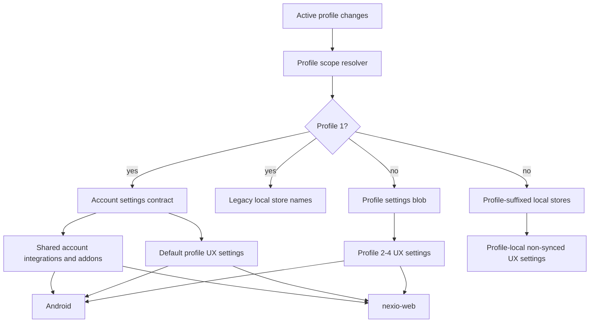

# refactor: Enforce Profile-Scoped Settings Isolation

## Overview

Nexio profiles currently have a mixed settings model: some Android settings are profile-scoped, some remain global, some web settings are account-level, and some recent profile sync changes moved individual settings without a durable ownership contract. This plan defines and implements a systemic profile settings isolation model so each profile can have a unique local settings store for every user-facing preference, while account-shared infrastructure remains shared.

This is not a language-only fix. Language is a symptom of the broader issue: any global local preference that affects the user experience can bleed between profiles or crash when profile switching and activity recreation interact with stale global state.

## Problem Frame

Profiles must behave like separate users on the same account. Profile 1 is the legacy/default account profile and must preserve pre-profile account behavior. Profiles 2-4 must be able to diverge for all user-facing preferences: language, theme, layout, playback, catalog visibility/order, provider catalog choices, formatter, search history, and profile-owned caches. Account-wide integrations and credentials remain shared unless explicitly profile-auth scoped, such as profile Trakt/SIMKL tokens.

Recent work exposed the lack of a clear contract:

- Profile 1 catalog settings could be reset by an empty profile settings blob.
- Android could pull a profile-1 blob while web intentionally uses account settings for profile 1.
- Language is stored in global `app_locale` SharedPreferences, so profile 2 changing language changes profile 1.
- Configured addon and catalog behavior depends on whether a setting path is handled by account sync, profile blob sync, or local-only storage.

## Requirements Trace

- R1. Every user-facing local Android setting must be assigned an explicit ownership class; no global local UX setting may bleed across profiles.
- R2. Profile 1 must preserve and continue using the pre-profile account settings contract for account catalogs and existing account-level behavior.
- R3. Profiles 2-4 must use profile-specific storage for profile settings, with no account-level overwrite on profile switch.
- R4. Account-shared configuration must remain shared: installed addons, addon secrets, account provider API keys, account-level MDBList availability, device/account auth, and shared service credentials.
- R5. Profile-scoped synced settings must round-trip through web, Supabase, and Android without shape drift.
- R6. Profile-local non-synced settings, including app language, must remain local to the active profile and must not be written into Supabase unless explicitly classified as synced.
- R7. Profile switching must not crash, reset settings, or apply stale settings from a previous profile.
- R8. Tests must prove representative divergence between profile 1 and profile 2 for each storage class, not just language.

## Scope Boundaries

- This plan does not add new product settings.
- This plan does not change account-level ownership of installed addons or account-wide integration credentials.
- This plan does not require a Supabase schema migration unless the audit finds the existing `profile_settings.settings_json` blob cannot represent an existing `profile-remote` setting.
- This plan does not make all settings web-editable. It ensures the storage and sync contract can support profile isolation first.
- This plan does not resolve unrelated stale Android unit-test constructor drift, except where tests directly covering this work need new helpers.

## Context & Research

### Relevant Code and Patterns

- `app/src/main/java/com/nexio/tv/data/local/ProfileDataStoreFactory.kt` already provides profile-scoped DataStore file names: profile 1 uses the legacy name, profiles 2-4 get `_p<id>` suffixes.
- `app/src/main/java/com/nexio/tv/core/sync/ProfilePrefsName.kt` already provides the same profile-1 legacy / profile-N suffix rule for SharedPreferences.
- `app/src/main/java/com/nexio/tv/data/local/ThemeDataStore.kt`, `LayoutPreferenceDataStore.kt`, `PlayerSettingsDataStore.kt`, `TraktSettingsDataStore.kt`, `SimklSettingsDataStore.kt`, `TraktAuthDataStore.kt`, `SimklAuthDataStore.kt`, and `SearchHistoryDataStore.kt` show the intended `ProfileDataStoreFactory` pattern.
- `app/src/main/java/com/nexio/tv/core/locale/AppLocaleResolver.kt` is a known counterexample: it uses global `app_locale` SharedPreferences and only has context-based APIs.
- `app/src/main/java/com/nexio/tv/core/sync/ProfileSettingsSyncService.kt` syncs profile settings blobs using Android feature roots: `trakt_settings`, `simkl_settings`, `player_settings`, `layout_settings`, and `theme_settings`.
- `nexio-web/server/utils/profile-settings-blob.ts` maps web `PortalSettings` into the Android profile-blob feature roots.
- `nexio-web/components/portal/ProfileCatalogsTab.vue` is the web boundary where profile 1 must use account catalog settings and profiles 2-4 must use profile settings.
- `supabase/migrations/20260414000200_phase5_profile_settings_blob.sql` and `supabase/migrations/20260414000300_phase5_profile_sync_rpcs.sql` define the profile settings blob table/RPCs.
- `supabase/migrations/20260412193000_account_config_v7_conflict_resolution.sql` defines account settings conflict handling and account snapshot payload shape.

### Institutional Learnings

- No directly relevant `docs/solutions/` learning was found for profile settings isolation.

### External References

- External research was skipped. The core risk is internal contract drift, and the repository already contains the relevant Android DataStore, SharedPreferences, Supabase, and web adapter patterns.

### Ownership Axes and Initial Classification

Settings ownership has two independent axes:

- **Identity scope:** `account`, `profile`, or `device`.
- **Persistence scope:** `remote-synced`, `local-only`, or `derived-cache`.

Unit 1 must classify every store on both axes before implementation changes. This prevents collapsing distinct questions such as "does profile 2 need its own value?" and "should that value sync through Supabase?"

Allowed ownership classes:

- `account-remote`: account-shared and synced via account settings, account addons, or account secrets.
- `profile-remote`: profile-scoped and synced via `profile_settings` blobs.
- `profile-local`: profile-scoped and never synced.
- `profile-derived-cache`: profile-scoped derived data, safe to delete/rebuild, and keyed by profile id plus language epoch when needed.
- `global-device`: truly device-wide capability/state only, such as one-time onboarding or hardware capability probes. User-facing preferences do not belong here.

This table is a planning seed, not the final contract. Unit 1 must verify and complete it before migration work.

| Class | Initial candidates | Rationale |
|-------|--------------------|-----------|
| `account-remote` | `AddonPreferences`, `TmdbSettingsDataStore`, `OmdbSettingsDataStore`, `ImdbSettingsDataStore`, `TheIntroDbSettingsDataStore`, `AnimeSkipSettingsDataStore`, `SubtitleTranslationSettingsDataStore`, `PosterRatingsSettingsDataStore`, `PremiumizeSettingsDataStore`, `TorBoxSettingsDataStore`, `EasyDebridSettingsDataStore`, account Real-Debrid credentials, account provider API keys | These represent installed providers/addons or account infrastructure shared by all profiles. |
| `profile-remote` | `ThemeDataStore`, `LayoutPreferenceDataStore`, `PlayerSettingsDataStore`, `TraktSettingsDataStore`, `SimklSettingsDataStore`, profile Trakt/SIMKL auth stores where applicable | These are user-facing preferences that should follow a profile across devices through `profile_settings` blobs for profiles 2-4, while profile 1 uses the account/default path. Unit 1 must verify whether each candidate should roam remotely or stay local. |
| `profile-local` | `AppLocaleResolver` language selection, search history, local-only UI preferences identified by Unit 1 | These should differ by profile on one device but should not automatically sync through Supabase. |
| `profile-derived-cache` | home catalog snapshots, synthetic home catalogs, metadata/cache stores whose content depends on active profile, locale, provider catalog choices, or auth state | These should not bleed between profiles and must include profile id, and sometimes language epoch, in their storage key. |
| `global-device` | device capability probes, one-time app onboarding, TV recommendation channel metadata if verified not user-preference-bearing | These are device-wide operational facts, not user preferences. Unit 1 must justify every item kept here. |

## Key Technical Decisions

- **Create an explicit settings ownership matrix before code changes:** The implementation must classify every settings store and cache on identity scope and persistence scope, then assign one allowed ownership class. This prevents narrow fixes such as language-only patches.
- **Profile 1 keeps legacy file names and account sync:** Profile 1 should not get duplicated `_p1` stores. It uses existing storage names to preserve upgrade behavior, and account settings remain its remote sync source.
- **Profiles 2-4 never use account settings for profile-owned UX preferences:** Profile-owned settings for secondary profiles must only use `profile-local` storage or `profile-remote` blob sync where applicable.
- **Account-shared integrations stay account-shared:** Provider API keys and installed addons are account resources. Profile visibility/order can differ, but the configured provider/addon availability remains shared unless already profile-auth scoped.
- **Context-only helpers need active-profile awareness:** Helpers such as `AppLocaleResolver` that are called from code with only `Context` need a safe active-profile bridge or a profile-aware API. Otherwise, profile-specific state will keep leaking through global context helpers.
- **Use characterization tests before moving existing stores:** Many stores are connected to UI, sync, and caches. Tests should lock current account/profile behavior before migration.

## Profile Switch Lifecycle Invariants

- On startup with active profile 1, Android must pull account snapshot settings and apply account-owned/default-profile UX settings. It must not pull or push a profile-1 settings blob.
- On startup with active profile 2-4, Android must pull account-shared infrastructure and then hydrate profile-owned UX settings from the active profile blob before observing/pushing profile-local DataStores.
- On switching to profile 1, account settings become the source for default-profile UX settings, and profile blob sync remains disabled.
- On switching to profile 2-4, account settings must not overwrite profile-owned UX settings. Profile blob hydration must complete before profile settings observers push local values.
- Web profile 1 surfaces must write account settings only. Web profiles 2-4 surfaces must write profile settings blobs for profile-owned UX settings.
- Profile-local settings never sync through Supabase. Profile-derived caches never sync as source-of-truth.

## Source of Truth Matrix

This table is the intended contract shape; Unit 1 must make it complete and authoritative.

| Surface | Profile 1 source | Profiles 2-4 source | Supabase owner | Android owner | Web owner |
|---|---|---|---|---|---|
| Installed addons and addon credentials | Account | Account | `account_addons_public`, `account_secrets` | `AddonPreferences`, addon secret RPCs | `usePortalStore`, account addon APIs |
| Catalog order and disabled catalog keys | Account settings | Profile settings blob | `account_settings_public` for profile 1; `profile_settings` for profiles 2-4 | `LayoutPreferenceDataStore` with profile-aware storage | `usePortalStore` for profile 1; `useProfileStore` for profiles 2-4 |
| Trakt/SIMKL catalog choices | Account/default profile settings | Profile settings blob | `account_settings_public` for profile 1; `profile_settings` for profiles 2-4 | `TraktSettingsDataStore`, `SimklSettingsDataStore` | account Integrations for profile 1; profile Auth/Integrations for profiles 2-4 |
| Formatter and playback UX settings | Account/default profile settings | Profile settings blob | `account_settings_public` for profile 1; `profile_settings` for profiles 2-4 | `PlayerSettingsDataStore` | account/profile formatter surfaces according to profile id |
| App language | Profile-local legacy key for profile 1 | Profile-local suffixed key | none | `AppLocaleResolver` profile-aware local prefs | Android-only unless web later gets language controls |
| Search history and local UI-only preferences | Profile-local | Profile-local | none | profile-aware local stores | Android-only unless web exposes equivalent local behavior |
| Home/metadata/synthetic caches | Profile-derived cache | Profile-derived cache | none | profile-aware cache stores | browser-local or recomputed state, not source-of-truth |
| Provider API keys and account provider availability | Account | Account | `account_settings_public`, `account_secrets` | provider settings stores and secret RPCs | account Integrations only |

## Open Questions

### Resolved During Planning

- **Should app language be fixed independently?** No. Language is one global-store symptom. The implementation must classify and isolate all user-facing settings.
- **Should profile 1 use profile settings blobs?** No. Profile 1 is the default account profile and must preserve pre-profile account sync behavior.
- **Should installed addons be profile-specific?** No. Installed addon availability and addon credentials remain account-shared. Per-profile catalog visibility/order remains profile-owned.

### Deferred to Implementation

- **Exact set of global caches that must become `profile-derived-cache`:** The audit unit must classify each cache based on whether its content depends on profile settings, active auth, language, or catalog visibility.
- **Whether each current global account-level setting should become `profile-remote`, `profile-local`, or remain `account-remote`:** The audit must decide based on product ownership and existing web/Supabase contracts.
- **Exact migration helper names:** The implementation can choose names once the store inventory is finalized.

## High-Level Technical Design

> *This illustrates the intended approach and is directional guidance for review, not implementation specification. The implementing agent should treat it as context, not code to reproduce.*

## Implementation Units

- [x] **Unit 1: Create Settings Ownership Matrix**

**Goal:** Produce a durable source-of-truth matrix for settings/caches so implementation is contract-led, not symptom-led.

**Requirements:** R1, R2, R3, R4, R6

**Dependencies:** None

**Files:**
- Create: `docs/architecture/profile-settings-scope.md`
- Create: `app/src/test/java/com/nexio/tv/sync/ProfileSettingsScopeContractTest.kt`
- Modify: `docs/plans/2026-04-15-002-refactor-profile-settings-isolation-plan.md` only if the audit materially changes sequencing

**Approach:**
- Inventory all Android stores using `preferencesDataStore`, `getSharedPreferences`, `ProfileDataStoreFactory`, and `profilePrefsName`.
- Classify each store on both axes:
  - Identity scope: `account`, `profile`, or `device`.
  - Persistence scope: `remote-synced`, `local-only`, or `derived-cache`.
- Assign each store one allowed ownership class: `account-remote`, `profile-remote`, `profile-local`, `profile-derived-cache`, or `global-device`.
- Record web/Supabase ownership for each `profile-remote` or `account-remote` surface.
- Explicitly include known stores: `AppLocaleResolver`, `ThemeDataStore`, `LayoutPreferenceDataStore`, `PlayerSettingsDataStore`, provider settings stores, addon stores, snapshot stores, search history, watch/progress stores, metadata caches, and recommendations stores.
- Stop after this unit for review of `docs/architecture/profile-settings-scope.md` before migrating stores.

**Execution note:** Characterization-first. Do not migrate stores until this matrix has tests covering representative examples.

**Patterns to follow:**
- `ProfileDataStoreFactory.get(profileId, featureName)` in `app/src/main/java/com/nexio/tv/data/local/ProfileDataStoreFactory.kt`
- `profilePrefsName(baseName, profileId)` in `app/src/main/java/com/nexio/tv/core/sync/ProfilePrefsName.kt`

**Test scenarios:**
- Happy path: the contract test asserts all known settings store files appear in exactly one ownership class with both axes recorded.
- Edge case: the contract test fails if a new `preferencesDataStore` declaration is added without classification.
- Edge case: the contract test fails if a new `getSharedPreferences` usage in `data/local` is not classified or explicitly exempted.
- Integration: the matrix records the Supabase/web owner for every `profile-remote` setting.
- Integration: the matrix records "none" as the Supabase owner for every `profile-local` and `profile-derived-cache` store.

**Verification:**
- The matrix can answer identity scope, persistence scope, ownership class, Android store, web owner, Supabase owner, migration behavior, and deletion behavior for every setting/cache without reading implementation code.

- [ ] **Unit 2: Introduce Profile Scope Helpers for Local Stores**

**Goal:** Provide reusable helpers so local settings and SharedPreferences can be profile-scoped consistently.

**Requirements:** R1, R3, R6, R7

**Dependencies:** Unit 1

**Planning checkpoint:** Do not start this unit until `docs/architecture/profile-settings-scope.md` has been reviewed and accepted as the implementation contract.

**Files:**
- Modify: `app/src/main/java/com/nexio/tv/data/local/ProfileDataStoreFactory.kt`
- Modify: `app/src/main/java/com/nexio/tv/core/sync/ProfilePrefsName.kt`
- Modify: `app/src/main/java/com/nexio/tv/core/profile/ProfileManager.kt`
- Test: `app/src/test/java/com/nexio/tv/data/local/ProfileDataStoreTest.kt`
- Test: `app/src/test/java/com/nexio/tv/core/profile/ProfileManagerTest.kt`

**Approach:**
- Keep the established rule: profile 1 uses legacy names, profiles 2-4 use `_p<id>` suffixes.
- Add or formalize a profile-scoped SharedPreferences access pattern for stores that cannot use DataStore.
- Ensure active profile changes can be observed safely by context-only utilities without storing cross-profile globals.
- Profile deletion must clear profile-suffixed stores and profile-suffixed SharedPreferences.

**Patterns to follow:**
- `ProfileDataStoreFactory.clearProfile(profileId)`
- Profile-specific snapshot stores such as `TraktDiscoverySnapshotStore` and `ContinueWatchingSnapshotStore`

**Test scenarios:**
- Happy path: profile 1 resolves base store names and profile 2 resolves suffixed store names.
- Happy path: deleting profile 2 clears `_p2` stores but leaves profile 1 stores untouched.
- Edge case: deleting and recreating profile 2 uses a fresh profile-scoped store rather than stale cached data.
- Integration: active profile switch updates the profile scope used by SharedPreferences helpers.

**Verification:**
- There is one reusable path for profile-scoped DataStore and one reusable path for profile-scoped SharedPreferences.

- [ ] **Unit 3: Migrate Profile-Local Settings and Caches**

**Goal:** Move every user-facing local-only setting and profile-sensitive cache out of global storage.

**Requirements:** R1, R3, R6, R7, R8

**Dependencies:** Unit 1, Unit 2

**Planning checkpoint:** Do not start this unit until `docs/architecture/profile-settings-scope.md` has been reviewed and accepted as the implementation contract.

**Files:**
- Modify: `app/src/main/java/com/nexio/tv/core/locale/AppLocaleResolver.kt`
- Modify: `app/src/main/java/com/nexio/tv/ui/screens/settings/ThemeSettingsScreen.kt`
- Modify: `app/src/main/java/com/nexio/tv/MainActivity.kt`
- Modify: `profile-derived-cache` stores identified by Unit 1, likely including:
  - `app/src/main/java/com/nexio/tv/data/local/HomeCatalogSnapshotStore.kt`
  - `app/src/main/java/com/nexio/tv/data/local/SyntheticHomeCatalogStore.kt`
  - `app/src/main/java/com/nexio/tv/data/local/MetadataDiskCacheStore.kt`
  - `app/src/main/java/com/nexio/tv/data/local/MDBListDiscoverySnapshotStore.kt`
- Test: `app/src/test/java/com/nexio/tv/core/locale/AppLocaleResolverTest.kt`
- Test: `app/src/test/java/com/nexio/tv/data/local/ProfileScopedPreferencesTest.kt`
- Test: cache-specific tests identified by Unit 1

**Approach:**
- Migrate language from global `app_locale/locale_tag` to a profile-aware key or profile-suffixed preferences.
- Preserve existing profile 1 language during migration by reading the legacy global key as profile 1’s initial value.
- Ensure profile 2 can set English while profile 1 remains Dutch.
- Apply the same profile-scope rule to any `profile-local` UX preferences identified in Unit 1.
- For caches, include profile id and language epoch when cache content depends on active profile or language.

**Patterns to follow:**
- Existing language epoch checks in `SyntheticHomeCatalogStore` and snapshot stores
- Existing profile-aware snapshot store constructors that accept `activeProfileId`

**Test scenarios:**
- Happy path: profile 1 language `nl`, profile 2 language `en`, switching between profiles returns the correct tag each time.
- Edge case: profile 2 with no explicit language falls back to system/default without modifying profile 1.
- Edge case: deleting profile 2 removes its language and cache state.
- Integration: activity base context resolves the active profile language without crashing.
- Integration: profile switch invalidates or separates language-sensitive home catalog snapshots.

**Verification:**
- Changing language or another local-only preference in profile 2 cannot change profile 1.

- [ ] **Unit 4: Reconcile Profile-Synced Settings Contract**

**Goal:** Ensure `profile-remote` settings round-trip consistently through Android, Supabase, and web.

**Requirements:** R2, R3, R5, R8

**Dependencies:** Unit 1, Unit 2

**Planning checkpoint:** Do not start this unit until `docs/architecture/profile-settings-scope.md` has been reviewed and accepted as the implementation contract.

**Files:**
- Modify: `app/src/main/java/com/nexio/tv/core/sync/ProfileSettingsSyncService.kt`
- Modify: `app/src/main/java/com/nexio/tv/core/sync/AccountSettingsSyncService.kt`
- Modify: `nexio-web/server/utils/profile-settings-blob.ts`
- Modify: `nexio-web/composables/useProfileStore.ts`
- Test: `app/src/test/java/com/nexio/tv/core/sync/ProfileSettingsSyncServiceTest.kt`
- Test: `app/src/test/java/com/nexio/tv/core/sync/AccountConfigSyncContractTest.kt`
- Test: `nexio-web/tests/profile-settings-blob.test.ts`

**Approach:**
- Confirm `ProfileSettingsSyncService.syncedFeatures` includes all `profile-remote` stores and excludes `profile-local`, `profile-derived-cache`, `account-remote`, and `global-device` stores.
- Confirm profile 1 profile-blob sync is a no-op.
- Confirm account sync applies profile-owned UX settings only for profile 1, and profile blob sync applies those settings only for profiles 2-4.
- Confirm web profile settings adapter writes Android-compatible feature roots for every synced setting in the matrix.
- Do not include `profile-local` non-synced settings, such as local-only language, in Supabase.

**Patterns to follow:**
- `nexio-web/server/utils/profile-settings-blob.ts` encoding of Android DataStore feature roots
- `app/src/main/java/com/nexio/tv/core/sync/ProfileSettingsSyncService.kt` encoded preference blob format

**Test scenarios:**
- Happy path: web saves profile 2 catalog order and formatter settings; Android imports them into profile 2 DataStores.
- Happy path: profile 1 account snapshot applies account catalog order, disabled keys, Trakt/SIMKL catalog choices, and formatter settings.
- Edge case: empty profile 1 blob cannot overwrite account/default profile settings.
- Edge case: profile 2 profile blob cannot overwrite account profile 1 settings.
- Integration: Android changes a profile 2 synced setting and pushes only the profile blob, not account settings.
- Integration: Android changes a profile 1 synced-like setting and pushes account settings, not a profile blob.

**Verification:**
- There is no code path where profile 1 reads `profile_settings` for profile-owned UX settings.

- [ ] **Unit 5: Align Web Profile UI with Settings Ownership**

**Goal:** Make web surfaces reflect the same ownership model as Android/Supabase.

**Requirements:** R2, R3, R4, R5, R8

**Dependencies:** Unit 1, Unit 4

**Planning checkpoint:** Do not start this unit until `docs/architecture/profile-settings-scope.md` has been reviewed and accepted as the implementation contract.

**Files:**
- Modify: `nexio-web/components/portal/ProfileCatalogsTab.vue`
- Modify: `nexio-web/components/portal/AuthPanel.vue`
- Modify: `nexio-web/components/portal/SettingsWorkspace.vue`
- Modify: `nexio-web/composables/usePortalStore.ts`
- Modify: `nexio-web/composables/useProfileStore.ts`
- Test: `nexio-web/tests/profile-settings-blob.test.ts`
- Test: `nexio-web/tests/profile-settings-ui-contract.test.ts`
- Test: add component/composable tests if the repo already has a Vue/Nuxt test harness; otherwise add a composable-level contract test under `nexio-web/tests/` that constructs account/profile store state and asserts ownership behavior.

**Approach:**
- Profile 1 UI uses account settings and account catalog inventory.
- Profiles 2-4 UI uses profile settings for profile-owned UX settings.
- Account integrations stay in account-level views.
- Profile-specific integration views only expose profile-owned auth/config such as profile Trakt/SIMKL, not account-level TheIntroDB or provider API keys.
- Web must not create profile 1 settings blobs for catalog/layout/formatter changes.

**Patterns to follow:**
- Existing `ProfileCatalogsTab` split between account inventory for profile 1 and profile store for profiles 2-4
- Existing profile Trakt/SIMKL endpoint separation under `nexio-web/server/api/integrations/profiles/`

**Test scenarios:**
- Happy path: default profile catalog UI displays account addon catalogs including Top Streaming after inspection.
- Happy path: profile 2 catalog UI displays profile 2 disabled/order state independently of profile 1.
- Edge case: account-level TheIntroDB does not appear inside profile 2 Auth/Profile integration panel.
- Edge case: changing profile 2 catalog order does not mutate account settings payload.
- Integration: saving default profile catalog settings writes account settings, not profile settings.

**Verification:**
- Web UI ownership matches the matrix and Android sync ownership for every settings class exposed in web, proven by behavioral/composable coverage rather than static string checks alone.

- [ ] **Unit 6: Add Cross-Profile Regression Coverage**

**Goal:** Prove the system supports profile divergence across representative settings, not just one setting.

**Requirements:** R1, R2, R3, R5, R6, R7, R8

**Dependencies:** Units 2-5

**Files:**
- Create or modify: `app/src/test/java/com/nexio/tv/profile/ProfileSettingsIsolationTest.kt`
- Modify: `app/src/test/java/com/nexio/tv/data/local/TraktSettingsDataStoreProfileTest.kt`
- Modify: `app/src/test/java/com/nexio/tv/data/local/SimklSettingsDataStoreProfileTest.kt`
- Modify: `app/src/test/java/com/nexio/tv/data/local/ProfileDataStoreTest.kt`
- Modify: `app/src/test/java/com/nexio/tv/core/sync/ProfileSettingsSyncServiceTest.kt`
- Modify: `app/src/test/java/com/nexio/tv/core/sync/AccountConfigSyncContractTest.kt`
- Test: `nexio-web/tests/profile-settings-blob.test.ts`

**Approach:**
- Use a small set of representative settings from each category:
  - profile-local: app language or a local-only UX cache.
  - profile-remote: catalog disabled keys, Trakt catalog enabled set, formatter template.
  - account-remote: installed addons or account provider API key.
  - profile-derived-cache: home or synthetic catalog snapshot.
  - global-device: a true device-wide state from the accepted matrix, if any.
- Validate both Android local behavior and web/Supabase shape behavior.
- Add tests in a way that avoids the existing stale broad test compile issue where possible; fix local test constructors only if they block this plan’s focused tests.

**Test scenarios:**
- Happy path: profile 1 Dutch + profile 2 English remain separate after switching.
- Happy path: profile 1 disables one catalog while profile 2 keeps it enabled.
- Happy path: profile 2 formatter differs from profile 1 and syncs through profile blob.
- Happy path: account addon install remains visible to both profiles while visibility/order differ.
- Edge case: deleting profile 2 removes profile 2 local and cache state but leaves account shared settings.
- Integration: startup sync with active profile 1 hydrates account settings; startup sync with active profile 2 hydrates profile blob settings.

**Verification:**
- A reviewer can see test coverage proving at least one representative setting in every ownership class behaves correctly.

## System-Wide Impact

- **Interaction graph:** Profile switching affects `ProfileManager`, `ProfileDataStoreFactory`, profile-suffixed SharedPreferences, `AccountSettingsSyncService`, `ProfileSettingsSyncService`, settings screens, home caches, metadata caches, and web profile views.
- **Error propagation:** Profile settings blob sync failures must not overwrite local account/default settings. Account sync failures must not clear profile-specific local state.
- **State lifecycle risks:** Activity recreation after language changes can apply stale global state unless locale lookup is profile-aware. Profile deletion can leave stale `_p<id>` stores if cleanup is incomplete.
- **API surface parity:** Android and web must agree on whether each setting is `account-remote`, `profile-remote`, `profile-local`, `profile-derived-cache`, or `global-device`. Supabase account settings and profile settings blobs must not both own the same value for the same profile.
- **Integration coverage:** Unit tests alone are insufficient for profile switching. The plan requires cross-layer scenarios covering startup sync, profile switch, web save, Android pull, Android push, and profile deletion.
- **Unchanged invariants:** Account provider credentials and installed addon availability remain shared account resources. Profile 1 keeps legacy storage names for upgrade compatibility.

## Risks & Dependencies

| Risk | Mitigation |
|------|------------|
| Misclassifying an account-level integration as profile-owned | Unit 1 matrix must explicitly classify all provider stores before migration. |
| Accidentally migrating profile 1 data into new suffixed stores | Keep profile 1 on legacy names and add tests for legacy preservation. |
| Profile 2 local-only settings accidentally sync to Supabase | Profile settings blob feature list must exclude `profile-local` stores, and tests must assert exclusions. |
| Cache data leaking between profiles | Classify profile-sensitive caches as `profile-derived-cache` and include profile id in their key or store name. |
| Existing broad Android tests block verification | Keep focused tests for new behavior and separately repair stale constructor tests if they block targeted suites. |
| Web and Android diverge again | Maintain the matrix as the source of truth and add static contract tests that fail on unclassified stores. |

## Documentation / Operational Notes

- Add `docs/architecture/profile-settings-scope.md` as the durable ownership reference.
- Document that profile 1 preserves legacy account behavior and storage names.
- Document that profiles 2-4 can diverge on `profile-local` and `profile-remote` UX settings.
- Document migration behavior for global legacy language and any other migrated global local setting.

## Sources & References

- Related code: `app/src/main/java/com/nexio/tv/data/local/ProfileDataStoreFactory.kt`
- Related code: `app/src/main/java/com/nexio/tv/core/sync/ProfilePrefsName.kt`
- Related code: `app/src/main/java/com/nexio/tv/core/locale/AppLocaleResolver.kt`
- Related code: `app/src/main/java/com/nexio/tv/core/sync/AccountSettingsSyncService.kt`
- Related code: `app/src/main/java/com/nexio/tv/core/sync/ProfileSettingsSyncService.kt`
- Related code: `nexio-web/server/utils/profile-settings-blob.ts`
- Related code: `nexio-web/components/portal/ProfileCatalogsTab.vue`
- Supabase: `supabase/migrations/20260414000200_phase5_profile_settings_blob.sql`
- Supabase: `supabase/migrations/20260414000300_phase5_profile_sync_rpcs.sql`
- Supabase: `supabase/migrations/20260412193000_account_config_v7_conflict_resolution.sql`
