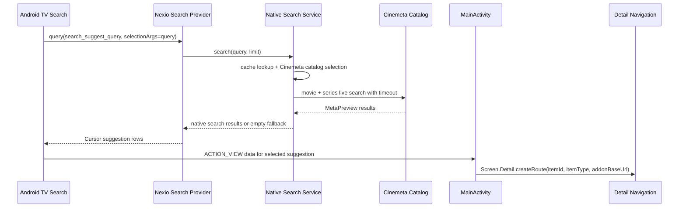

# feat: Add Android TV Native Search

## Overview

Expose Nexio to Android TV native/global search as a live Cinemeta-backed suggestion source. Android TV search should be able to ask Nexio for movie and TV show suggestions, display those results using Android's searchable app contract, and open the selected result on Nexio's existing detail page.

The first implementation deliberately stays detail-page only. It does not fan out across installed addons, resolve streams, infer TV episodes, start deterministic autoplay, or add a Nexio setting gate (see origin: `docs/brainstorms/2026-04-15-android-tv-native-search-requirements.md`).

## Problem Frame

Users currently need to launch Nexio before searching for content. Android TV native search can make Nexio feel integrated with the device by letting users search from the home/search UI and jump directly into Nexio. The risk is that Android search is a synchronous platform provider contract, while Nexio's metadata source is a live network call. The plan therefore keeps the source narrow, uses strict timeout/fallback behavior, and reuses current detail navigation instead of introducing playback decisions from a system search surface.

## Requirements Trace

- R1. Expose Nexio as an Android TV searchable app for movies and shows.
- R2. Enable the integration by default from Nexio's side.
- R3. Publish searchable metadata so Android TV can list Nexio as a searchable source when the platform requires user-level enablement.
- R4. Use live Cinemeta search for v1 suggestions.
- R5. Search only Cinemeta movie and series catalogs.
- R6. Return movie and TV show results when relevant.
- R7. Return no suggestions quickly when Cinemeta is slow, unavailable, or errors.
- R8. Allow brief in-memory response caching without creating a persistent index.
- R9. Open selected results on the Nexio detail page.
- R10. Open TV shows on show detail, not an inferred episode or stream.
- R11. Open movies on movie detail, not stream selection/autoplay/player.
- R12. Reuse existing detail navigation semantics where practical.
- R13. Populate useful Android suggestion metadata where reliable.
- R14. Omit year/runtime when not confidently derivable.
- R15. Preserve item ID, content type, and addon base URL for detail routing.
- R16. Do not trigger stream/source resolution.
- R17. Do not require user-specific integrations.
- R18. Do not expose private installed addon catalogs.
- R19. Avoid raw search-query logging at production log levels.
- R20. Provider failures must not crash Nexio or interfere with Android TV recommendation channels.

## Scope Boundaries

- Do not build a persistent local search index.
- Do not search all installed addons.
- Do not add a Nexio setting for this feature.
- Do not launch stream selection, autoplay, or the player from native search.
- Do not support episode-level native search.
- Do not include user library, watch history, Trakt, SIMKL, debrid, or private addon results.
- Do not redesign the in-app search screen.

## Context & Research

### Relevant Code and Patterns

- `app/src/main/AndroidManifest.xml` currently exposes `MainActivity`, leanback launcher metadata, the app `FileProvider`, and Android TV recommendation permissions. No native search provider or searchable XML exists yet.
- `app/src/main/java/com/nexio/tv/MainActivity.kt` already handles `ACTION_VIEW`-style recommendation launch extras and pushes selected content into existing detail navigation.
- `app/src/main/java/com/nexio/tv/ui/navigation/Screen.kt` and `app/src/main/java/com/nexio/tv/ui/navigation/NexioNavHost.kt` provide the existing `Screen.Detail.createRoute(...)` path used by in-app search and Android TV recommendation channels.
- `app/src/main/java/com/nexio/tv/ui/screens/search/SearchViewModel.kt` already discovers searchable catalogs by required `search` extra and queries catalogs with `extraArgs = mapOf("search" to query)`.
- `app/src/main/java/com/nexio/tv/data/repository/CatalogRepositoryImpl.kt` already builds Stremio catalog URLs of the shape needed for Cinemeta search and logs sanitized URLs.
- `app/src/main/java/com/nexio/tv/data/mapper/CatalogMapper.kt` maps Stremio `MetaPreviewDto` fields into `MetaPreview`, including title, poster, description, release info, runtime, type, and ID.
- `app/src/main/java/com/nexio/tv/data/repository/IdleScreensaverRepository.kt` and `app/src/test/java/com/nexio/tv/data/repository/IdleScreensaverRepositoryTest.kt` already recognize stock Cinemeta at `https://v3-cinemeta.strem.io`.
- `app/src/test/java/com/nexio/tv/core/recommendations/AndroidTvProgramPresentationTest.kt` and `app/src/test/java/com/nexio/tv/core/recommendations/AndroidTvOwnedChannelRowsTest.kt` show existing Android TV contract testing patterns with `TvContractCompat` and `MatrixCursor`.

### Institutional Learnings

- No `docs/solutions/` directory exists in this checkout, so no institutional solution notes were available.

### External References

- Android TV search docs say TV apps need a suggestion `ContentProvider`, `searchable.xml`, and an activity that handles selected-result intents. They also note the provider must be exported for Android global search.
- Android TV search docs show `searchable.xml` with `android:searchSuggestAuthority`, `android:searchSuggestIntentAction="android.intent.action.VIEW"`, `android:searchSuggestSelection=" ?"`, `android:searchSuggestThreshold`, and `android:includeInGlobalSearch="true"`.
- Android TV search docs say home entity-card playback option inclusion depends on matching title, year, and duration, but apps cannot programmatically force placement into the entity card.
- Android custom suggestion docs say selected suggestions can be delivered as `ACTION_VIEW` with data synthesized from `android:searchSuggestIntentData` and `SUGGEST_COLUMN_INTENT_DATA_ID`, and that global/Quick Search suggestions may require users to enable the app in system settings.
- Android `SearchManager` docs define media-specific suggestion columns including `SUGGEST_COLUMN_PRODUCTION_YEAR`, `SUGGEST_COLUMN_DURATION`, and `SUGGEST_COLUMN_RESULT_CARD_IMAGE`; the result-card image column expects a drawable resource ID or content/android.resource/file URI, so remote HTTP poster URLs should not be assumed valid for that column.
- Hilt docs recommend `@EntryPoint` access for Android-instantiated or unsupported entry points that cannot use normal constructor injection.

## Key Technical Decisions

- **Create a narrow native-search service rather than reusing `SearchViewModel`:** `SearchViewModel` is UI stateful, saves recent searches, and fans out across all searchable addons. Native search needs a non-UI service that only uses Cinemeta and has strict timeout/cache behavior.
- **Resolve Cinemeta from installed/cached addons first, then use a stock fallback:** Prefer the user's installed Cinemeta manifest when present so catalog IDs and metadata stay aligned with the app. If Cinemeta is missing from installed addons, planning accepts a stock `https://v3-cinemeta.strem.io` fallback for movie and series search only, because R2 says the feature is enabled by default and R17 says it should not depend on user-specific integrations.
- **Use a short provider timeout:** Start with a 750ms service-level timeout for live search. This is intentionally below normal app network timeouts because Android search calls the provider as the user types. Empty results are better than a blocked system search UI.
- **Use small in-memory cache only:** Cache recent query results in-process with a small LRU and short TTL, such as 20 queries for 2 minutes. This satisfies R8 without becoming a persistent index.
- **Route selected suggestions through an internal `nexio://detail/...` URI or equivalent data URI handled by `MainActivity`:** Use Android's suggested `ACTION_VIEW` data handoff, but keep the payload limited to item ID, type, and addon base URL so detail navigation remains the source of truth.
- **Do not expose remote HTTP posters as `SUGGEST_COLUMN_RESULT_CARD_IMAGE` unless verified:** Android's API reference lists content/resource/file URI support for result-card images. The first implementation should either omit that column or use a locally supported URI strategy after verification.
- **Avoid raw query logging:** Search provider and live-query service logs should report outcome, source, counts, and coarse reason codes without raw user query strings.

## Open Questions

### Resolved During Planning

- **Provider metadata and manifest shape:** Use `res/xml/searchable.xml`, an exported provider whose authority matches `searchSuggestAuthority`, and a searchable `MainActivity` manifest entry for `ACTION_SEARCH`/search metadata, following Android TV docs.
- **Cinemeta source discovery:** Prefer installed/cached Cinemeta; fall back to stock Cinemeta for movie and series search if missing.
- **Latency budget:** Start with a 750ms service timeout and empty result fallback. Adjust only if device testing shows Android TV search consistently needs a different threshold.
- **Recent response cache:** Use process-local LRU with short TTL. Do not persist.
- **Launch handoff:** Use `ACTION_VIEW` suggestion data into `MainActivity` and convert to existing pending detail navigation.
- **Metadata mapping:** Map title, subtitle/type, item ID/type/addon base URL, production year parsed from `releaseInfo`, and duration parsed only when runtime is clearly minute-based. Omit uncertain values.

### Deferred to Implementation

- **Exact stock Cinemeta search catalog IDs:** Confirm from the live or cached Cinemeta manifest during implementation; do not hardcode more than the base URL and expected movie/series search capability until inspected.
- **Result-card artwork support:** Verify on target Android TV behavior whether omitting `SUGGEST_COLUMN_RESULT_CARD_IMAGE` is acceptable and whether any existing local image/cache mechanism can safely provide content URIs later.
- **Device-level global search behavior:** Android TV search behavior varies by launcher/device. Confirm on emulator or device after implementation without expanding scope.

## High-Level Technical Design

> *This illustrates the intended approach and is directional guidance for review, not implementation specification. The implementing agent should treat it as context, not code to reproduce.*

## Implementation Units

- [x] **Unit 1: Add Cinemeta Native Search Service**

**Goal:** Create a non-UI service that performs live Cinemeta movie and series search with timeout, source isolation, and no user-specific dependencies.

**Requirements:** R4, R5, R6, R7, R16, R17, R18, R19

**Dependencies:** None

**Files:**
- Create: `app/src/main/java/com/nexio/tv/core/search/AndroidTvNativeSearchService.kt`
- Create: `app/src/main/java/com/nexio/tv/core/search/AndroidTvNativeSearchResult.kt`
- Modify: `app/src/main/java/com/nexio/tv/core/di/RepositoryModule.kt` or the relevant Hilt module only if a binding is needed
- Test: `app/src/test/java/com/nexio/tv/core/search/AndroidTvNativeSearchServiceTest.kt`

**Approach:**
- Resolve a Cinemeta source by checking installed/cached addons for base URL `https://v3-cinemeta.strem.io`.
- If no installed/cached source exists, fetch or synthesize the stock Cinemeta search capability using `AddonRepository.fetchAddon(...)` against the stock base URL, then pick movie and series catalogs that require/support the `search` extra.
- Query only Cinemeta movie and series catalog targets through the existing `CatalogRepository` path with `extraArgs = mapOf("search" to query)`.
- Run the two content-type lookups under a service-level timeout. On timeout, network error, malformed manifest, missing catalogs, or empty query, return an empty list.
- Deduplicate by `apiType:id`, cap results to the requested provider limit, and keep movie/show typing intact.
- Do not write search history, do not read user library/tracking providers, and do not call stream repositories.
- Log reason codes such as `empty_query`, `cinemeta_missing`, `timeout`, `success_count`, without raw query text.

**Execution note:** Implement service behavior test-first because timeout/error behavior is the main product contract.

**Patterns to follow:**
- `app/src/main/java/com/nexio/tv/ui/screens/search/SearchViewModel.kt` for searchable catalog discovery rules.
- `app/src/main/java/com/nexio/tv/data/repository/IdleScreensaverRepository.kt` for stock Cinemeta base URL recognition.
- `app/src/main/java/com/nexio/tv/data/repository/CatalogRepositoryImpl.kt` for catalog fetch behavior and sanitized logging expectations.

**Test scenarios:**
- Happy path: query `"matrix"` with Cinemeta movie and series search targets returning items -> service returns both content types with original IDs, names, types, release info, runtime, and addon base URL.
- Happy path: Cinemeta absent from installed cached addons but fetchable from stock base URL -> service still returns movie/series search results.
- Edge case: blank or one-character query -> service returns empty results without calling `CatalogRepository`.
- Edge case: duplicate movie/series records with the same `apiType:id` -> service returns one result.
- Error path: one Cinemeta catalog fails and the other succeeds -> service returns successful results only.
- Error path: Cinemeta manifest has no movie/series search catalogs -> service returns empty results.
- Error path: live search exceeds the timeout -> service returns empty results and does not throw.
- Error path: downstream repository throws unexpectedly -> service catches and returns empty results.
- Privacy path: logger/test hook receives no raw query string when a search succeeds, fails, or times out.

**Verification:**
- Unit tests prove the service never fans out beyond Cinemeta, never triggers streams, and always returns within the configured timeout contract.

- [x] **Unit 2: Add Suggestion Mapping and Short-Lived Cache**

**Goal:** Convert native search results into Android-compatible suggestion row data and cache recent query responses without creating persistent state.

**Requirements:** R7, R8, R13, R14, R15, R19

**Dependencies:** Unit 1

**Files:**
- Create: `app/src/main/java/com/nexio/tv/core/search/AndroidTvSearchSuggestionMapper.kt`
- Create: `app/src/main/java/com/nexio/tv/core/search/AndroidTvSearchSuggestionCache.kt`
- Test: `app/src/test/java/com/nexio/tv/core/search/AndroidTvSearchSuggestionMapperTest.kt`
- Test: `app/src/test/java/com/nexio/tv/core/search/AndroidTvSearchSuggestionCacheTest.kt`

**Approach:**
- Define a small internal suggestion model that maps to `MatrixCursor` rows later, rather than coupling mapping logic directly to the provider.
- Include stable row ID, title, secondary text, item ID, content type, addon base URL, optional production year, optional duration milliseconds, and shortcut policy.
- Parse production year only from clear year patterns in `releaseInfo`, such as a leading four-digit year.
- Parse duration only from clearly minute-based runtime values and convert to milliseconds only when unambiguous.
- Use `SearchManager.SUGGEST_NEVER_MAKE_SHORTCUT` or an equivalent no-shortcut strategy so Android does not pin stale live-search suggestions indefinitely.
- Use an in-memory LRU keyed by normalized query and limit; expire entries after a short TTL.

**Patterns to follow:**
- `app/src/test/java/com/nexio/tv/core/recommendations/AndroidTvProgramPresentationTest.kt` for Android TV presentation-focused unit testing.
- `app/src/test/java/com/nexio/tv/core/recommendations/AndroidTvOwnedChannelRowsTest.kt` for `MatrixCursor`-adjacent contract testing.

**Test scenarios:**
- Happy path: movie result with `releaseInfo = "1999"` and `runtime = "136 min"` -> suggestion includes production year 1999 and duration in milliseconds.
- Happy path: series result -> suggestion secondary text identifies it as a series/show and preserves content type for routing.
- Edge case: `releaseInfo = "1999-2003"` -> production year maps to 1999 only if parsing is deterministic.
- Edge case: runtime is blank, `"2 seasons"`, or otherwise ambiguous -> duration is omitted.
- Edge case: result has no poster/background -> suggestion still maps title and routing data.
- Error path: malformed or missing item ID/type -> mapper drops the result rather than producing an unlaunchable suggestion.
- Cache path: repeated query within TTL returns cached suggestions without invoking the search service.
- Cache path: query after TTL expiry invokes the service again.
- Cache path: adding more than max entries evicts the oldest normalized query.

**Verification:**
- Mapping tests cover every suggestion field used by the provider, and cache tests prove the cache is process-local and TTL-bound.

- [x] **Unit 3: Implement Android Search Provider and Searchable Metadata**

**Goal:** Register Nexio with Android TV native search and return suggestion cursors backed by the live Cinemeta service.

**Requirements:** R1, R2, R3, R4, R7, R8, R13, R14, R15, R19, R20

**Dependencies:** Unit 1, Unit 2

**Files:**
- Create: `app/src/main/java/com/nexio/tv/core/search/AndroidTvSearchProvider.kt`
- Create: `app/src/main/res/xml/searchable.xml`
- Modify: `app/src/main/AndroidManifest.xml`
- Modify: `app/src/main/res/values/strings.xml`
- Modify: localized string files only if required by existing resource policy, such as `app/src/main/res/values-nl/strings.xml`, `app/src/main/res/values-de/strings.xml`, and `app/src/main/res/values-es/strings.xml`
- Test: `app/src/test/java/com/nexio/tv/core/search/AndroidTvSearchProviderTest.kt`
- Test: `app/src/test/java/com/nexio/tv/core/search/AndroidTvSearchManifestContractTest.kt`

**Approach:**
- Add `res/xml/searchable.xml` with the Nexio label, concise settings description, matching `searchSuggestAuthority`, `ACTION_VIEW` suggestion action, `searchSuggestSelection=" ?"`, a reasonable threshold, and `includeInGlobalSearch="true"`.
- Register the provider in `AndroidManifest.xml` with an authority derived from `${applicationId}` and `android:exported="true"` so Android global search can query it.
- Add searchable metadata and the `ACTION_SEARCH` intent filter to `MainActivity` per Android TV docs, while keeping existing launcher filters intact.
- Use a Hilt `@EntryPoint` installed in `SingletonComponent` for provider access to `AndroidTvNativeSearchService` and cache, because providers are platform-instantiated.
- Implement `query()` to accept only Android search suggestion query/shortcut paths, honor `SearchManager.SUGGEST_PARAMETER_LIMIT` when present, call the cache/service, and return a `MatrixCursor` with the selected suggestion columns.
- Return an empty cursor, not null or an exception, for unsupported/malformed user queries that Android search may issue. Throw only for truly invalid provider paths if that matches Android provider conventions and tests cover it.
- Keep provider `insert`, `update`, and `delete` unsupported/no-op as appropriate for read-only suggestions.

**Patterns to follow:**
- Android TV recommendation provider/contract style in `app/src/main/java/com/nexio/tv/core/recommendations/AndroidTvChannelPublisher.kt`.
- Existing manifest provider declaration for `androidx.core.content.FileProvider` in `app/src/main/AndroidManifest.xml`.
- Hilt entry point access pattern from Dagger/Hilt docs.

**Test scenarios:**
- Happy path: provider query with path `search_suggest_query` and selectionArgs `["matrix"]` returns cursor rows with `_id`, title, optional year/duration, intent data ID or data URI, and no-shortcut policy.
- Happy path: provider honors requested limit and caps rows accordingly.
- Edge case: selectionArgs missing, blank, or empty -> provider returns an empty cursor.
- Edge case: unsupported path -> provider rejects or returns empty according to the chosen provider contract, consistently documented in tests.
- Error path: service times out or throws -> provider returns an empty cursor and does not crash.
- Integration path: `searchable.xml` authority matches the manifest provider authority.
- Integration path: `MainActivity` manifest metadata points to `@xml/searchable` and the provider is exported.
- Privacy path: provider logs do not include raw query text.

**Verification:**
- Robolectric/unit tests prove cursor shape, authority consistency, and failure behavior without requiring a TV device.

- [x] **Unit 4: Route Selected Native Search Results to Detail**

**Goal:** Deliver selected Android TV suggestions into Nexio's existing detail navigation without stream or episode side effects.

**Requirements:** R9, R10, R11, R12, R15, R16, R20

**Dependencies:** Unit 2, Unit 3

**Files:**
- Modify: `app/src/main/java/com/nexio/tv/MainActivity.kt`
- Modify: `app/src/main/java/com/nexio/tv/ui/navigation/Screen.kt` only if route helper support is needed
- Test: `app/src/test/java/com/nexio/tv/AndroidTvNativeSearchIntentTest.kt`
- Test: `app/src/test/java/com/nexio/tv/ui/navigation/ScreenRouteTest.kt` only if route helper behavior changes

**Approach:**
- Extend `MainActivity` intent handling to recognize the `ACTION_VIEW` data URI or extras emitted by native search suggestions.
- Normalize and validate item ID, content type, and optional addon base URL before setting the same pending detail navigation state used by Android TV recommendation programs.
- Remove or consume native-search extras/data after handling to avoid duplicate navigation on warm `singleTask` launches.
- Leave `ACTION_SEARCH` text-query handling minimal. Since selected suggestions use `ACTION_VIEW`, raw query search launches should not invent new behavior beyond safe no-op or opening the existing in-app search screen if the implementation chooses that as a compatibility fallback.
- Ensure TV show results route to `Screen.Detail`, not `Screen.Stream`, and do not pass season/episode arguments.

**Patterns to follow:**
- Existing `handleRecommendationIntent(...)` and `pendingRecommendationNavigation` flow in `app/src/main/java/com/nexio/tv/MainActivity.kt`.
- Existing detail routes from in-app search in `app/src/main/java/com/nexio/tv/ui/navigation/NexioNavHost.kt`.

**Test scenarios:**
- Happy path: `ACTION_VIEW` with movie suggestion data -> pending detail navigation contains movie ID/type/addon base URL.
- Happy path: `ACTION_VIEW` with series suggestion data -> pending detail navigation contains series ID/type and no season/episode routing.
- Edge case: malformed URI or missing item ID/type -> intent is ignored without crash.
- Edge case: unknown content type -> intent is ignored or normalized only if existing `ContentType` behavior supports it safely.
- Integration path: handled native-search intent reuses the same detail navigation route shape as recommendation and in-app search details.
- Regression path: existing recommendation extras still navigate to detail after native-search handling is added.
- Regression path: `onNewIntent(...)` handles native-search suggestions for an already-running `singleTask` activity.

**Verification:**
- Tests prove selected suggestions cannot reach stream selection, autoplay, or player routes.

- [x] **Unit 5: Add End-to-End Verification Coverage and Device Checklist**

**Goal:** Verify the Android TV search integration across local tests and manual/device behavior without broadening v1 scope.

**Requirements:** R1-R20

**Dependencies:** Unit 1, Unit 2, Unit 3, Unit 4

**Files:**
- Create: `app/src/test/java/com/nexio/tv/core/search/AndroidTvNativeSearchContractTest.kt`
- Create or update: `docs/instrumentation/android-tv-native-search-checklist.md`
- Modify: `README.md` only if the project documents Android TV integration surfaces there

**Approach:**
- Add one cross-layer contract test that exercises service -> mapper -> provider cursor -> launch URI parsing with fake Cinemeta results.
- Add a manual checklist for emulator/device verification because Android TV launcher/global search behavior is device-dependent.
- The checklist should cover installing a debug build, confirming Nexio appears as a searchable source where the platform exposes that UI, searching a known movie and show, selecting the result, confirming detail navigation, confirming failure/timeout behavior with network disabled, and confirming recommendation channels still work.
- Keep documentation operational, not promotional.

**Patterns to follow:**
- Existing instrumentation docs such as `docs/instrumentation/android-tv-playback-architecture-audit.md`.
- Existing Android TV recommendation tests under `app/src/test/java/com/nexio/tv/core/recommendations/`.

**Test scenarios:**
- Integration path: fake Cinemeta movie result flows through service/mapper/provider into a launch payload that `MainActivity` parsing accepts.
- Integration path: fake Cinemeta series result flows through the same path and opens detail-only routing.
- Error path: fake service timeout flows through provider as an empty cursor.
- Regression path: existing Android TV channel/recommendation code paths are unaffected by native search provider additions.
- Manual path: Android TV device/emulator checklist confirms platform search behavior that unit tests cannot prove.

**Verification:**
- Contract tests cover the cross-layer shape, and manual checklist provides explicit device validation steps for Android TV global search behavior.

## System-Wide Impact

- **Interaction graph:** Android TV search will gain a new exported provider entry point that calls a narrow search service, plus a new `ACTION_VIEW` path into `MainActivity`. Existing in-app search remains UI-owned and unchanged.
- **Error propagation:** Search-service errors and timeouts collapse to empty suggestion cursors. They should not surface dialogs, app crashes, or persistent error state.
- **State lifecycle risks:** The only new state should be process-local in-memory cache. No persistent index, DataStore setting, or search-history write is part of v1.
- **API surface parity:** The new provider is an exported Android component. Manifest authority, searchable XML authority, and launch URI parsing must remain in sync.
- **Integration coverage:** Unit tests cover service/mapping/provider behavior; manual device checks are still required because Android TV launcher search behavior varies.
- **Unchanged invariants:** Stream resolution, deterministic autoplay, player launch, in-app search fan-out, Android TV recommendation channels, Trakt/SIMKL/debrid integrations, and profile-specific search history remain unchanged.

## Risks & Dependencies

| Risk | Mitigation |
|------|------------|
| Provider live network call blocks Android TV search | Hard service timeout, empty-result fallback, short in-memory cache |
| Global search exposes private addon content | Search only stock/installed Cinemeta movie and series search targets |
| Android stores stale suggestion shortcuts | Mark suggestions as never-make-shortcut or implement refresh behavior if shortcuts are unavoidable |
| Remote poster URLs do not work in result-card image column | Omit result-card image initially unless content/resource URI support is verified |
| Hilt injection is unavailable in a platform-instantiated provider | Use a Hilt `@EntryPoint` installed in `SingletonComponent` |
| Launch URI parser opens wrong route | Route only to detail after validating item ID and content type; add regression tests for no stream/player route |
| Device/launcher behavior differs from docs | Add manual Android TV verification checklist after unit coverage |
| Raw query text leaks through logs | Use reason-code logs and audit provider/service logs |

## Documentation / Operational Notes

- Add a device verification checklist rather than user-facing marketing docs.
- No release notes, version bumps, or root changelog entries are part of this normal feature plan.
- If README mentions Android TV integration surfaces or counts, update it only if the new native-search surface makes existing README content inaccurate.

## Sources & References

- **Origin document:** [docs/brainstorms/2026-04-15-android-tv-native-search-requirements.md](../brainstorms/2026-04-15-android-tv-native-search-requirements.md)
- Android TV search docs: [Make TV apps searchable](https://developer.android.google.cn/training/tv/discovery/searchable?hl=en)
- Android custom suggestions docs: [Add custom search suggestions](https://developer.android.google.cn/develop/ui/views/search/adding-custom-suggestions)
- Android `SearchManager` API reference: [SearchManager](https://developer.android.com/reference/android/app/SearchManager)
- Hilt entry point docs: [Entry Points](https://dagger.dev/hilt/entry-points.html)
- Related code: `app/src/main/java/com/nexio/tv/MainActivity.kt`
- Related code: `app/src/main/java/com/nexio/tv/ui/screens/search/SearchViewModel.kt`
- Related code: `app/src/main/java/com/nexio/tv/data/repository/CatalogRepositoryImpl.kt`
- Related code: `app/src/main/java/com/nexio/tv/core/recommendations/AndroidTvChannelPublisher.kt`
