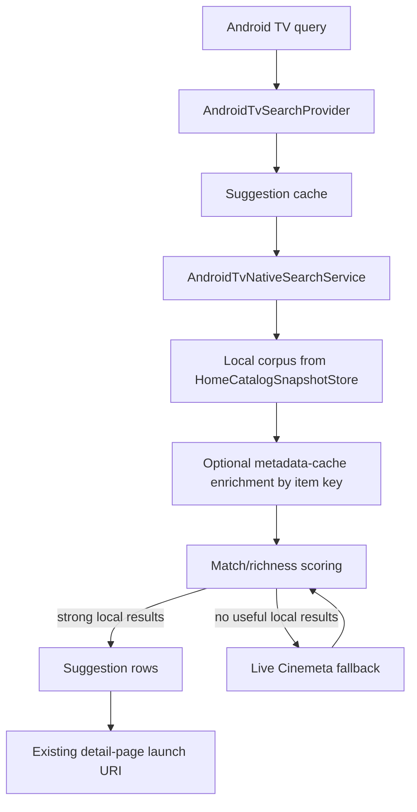

# feat: Add Android TV Local Search Corpus

## Overview

Improve Android TV/Google TV entity-card provider matching by making Nexio's native search provider return high-confidence local cache results before live Cinemeta results. The local corpus should come from already-persisted Home/catalog state, carry richer title/year/runtime metadata when available, and rank exact local matches above weaker live matches.

The first follow-up stays app-local. It does not build Google Media Actions/Engage ingestion, does not crawl all addons, and does not start playback from Android TV entity cards.

## Problem Frame

The first Android TV native-search implementation exposes a searchable provider backed by live Cinemeta and routes selected results to Nexio detail pages. That supports standalone Nexio suggestions, but Android TV entity-card deep-link eligibility is stricter: the app needs to provide title, production year, and duration that match the Google entity. Nexio's best data for titles already visible on modern Home is not live Cinemeta; it is the local Home/catalog snapshot plus hydrated metadata cache.

This plan extends the native-search provider with a local-first corpus and explicit match/richness scoring. The goal is to give Android TV the strongest possible app-provided suggestion rows for cached titles while preserving the current fast, safe Cinemeta fallback.

## Requirements Trace

- R1. Improve Nexio's eligibility to appear as an app option on Android TV/Google TV media detail pages.
- R2. Target Android TV entity-card matching first; defer full Media Actions/Engage ingestion.
- R3. Keep selected Nexio results detail-page only.
- R4. Search local metadata/Home/catalog cache before live Cinemeta.
- R5. Include persisted modern Home/catalog state: visible rows, full cached rows, and hero items where safe.
- R6. Return local results near-instantly without network.
- R7. Preserve item ID, type, route source, title, year, runtime, artwork, and description.
- R8. Deduplicate by stable identity and keep the richest routeable metadata.
- R9-R11. Keep live Cinemeta fallback, without letting weak live results outrank strong local matches.
- R12-R15. Emit match-friendly title/year/duration metadata and rank exact normalized title matches first.
- R16-R20. Improve runtime completeness only through bounded, existing metadata/cache paths.
- R21-R25. Avoid private live addon exposure, stream resolution, hard user-integration requirements, crashes, and raw query logging.

## Scope Boundaries

- Do not build Google Media Actions or Engage SDK feed ingestion in this phase.
- Do not guarantee Android TV/Google TV will always show Nexio; provider placement remains platform-controlled.
- Do not launch stream selection, deterministic autoplay, or player from entity-card/native-search results.
- Do not infer or open TV episodes from title-level Android TV entity cards.
- Do not live-search every installed addon.
- Do not create a standalone persistent search index if Home/catalog snapshots are sufficient.
- Do not hydrate runtime by crawling every catalog item in the background.

## Context & Research

### Relevant Code and Patterns

- `app/src/main/java/com/nexio/tv/core/search/AndroidTvNativeSearchService.kt` currently performs live Cinemeta-only search with a 750ms timeout and no stream-resolution dependency.
- `app/src/main/java/com/nexio/tv/core/search/AndroidTvSearchSuggestionMapper.kt` maps `AndroidTvNativeSearchResult` into Android TV suggestion rows, parsing production year and minute-based runtime.
- `app/src/main/java/com/nexio/tv/core/search/AndroidTvSearchProvider.kt` provides Android's synchronous `ContentProvider` query entry point and uses the process-local suggestion cache.
- `app/src/main/java/com/nexio/tv/data/local/HomeCatalogSnapshotStore.kt` persists `catalogRows`, `fullCatalogRows`, `heroItems`, and `orderedGroupKeys` as `MetaPreview`/`CatalogRow` values scoped by active profile and language.
- `app/src/main/java/com/nexio/tv/domain/model/MetaPreview.kt` already carries `id`, `rawType`, `name`, `releaseInfo`, `runtime`, artwork, description, genres, language, and poster-rating data.
- `app/src/main/java/com/nexio/tv/data/local/MetadataDiskCacheStore.kt` persists richer `Meta` records. It can check current metadata by item key and language, but current read APIs require exact item key/language/provider token rather than global enumeration.
- `app/src/main/java/com/nexio/tv/ui/screens/home/HomeCatalogRefreshCoordinator.kt` already hydrates Home catalog items by fetching metadata and merging `Meta` into `MetaPreview`.
- `app/src/main/java/com/nexio/tv/ui/screens/home/HomeViewModelContinueWatchingRuntimePipeline.kt` contains useful runtime-resolution patterns for bounded runtime hydration, but it is specific to Continue Watching episodes.
- Existing tests under `app/src/test/java/com/nexio/tv/core/search/` cover live search, mapping, cache, cursor shape, and launch URI behavior. `app/src/test/java/com/nexio/tv/data/local/HomeCatalogSnapshotStoreTest.kt` covers Home snapshot persistence.

### Institutional Learnings

- No `docs/solutions/` directory exists in this checkout, so no institutional solution notes were available.

### External References

- Android TV searchable-app docs state that for a deep link to be provided in the content details view, the app's content must match Google server provider data, and matching requires title, production year, and duration.
- Android `SearchManager` defines the relevant suggestion columns: `SUGGEST_COLUMN_TEXT_1`, `SUGGEST_COLUMN_PRODUCTION_YEAR`, and `SUGGEST_COLUMN_DURATION`.
- Android TV Watch Next docs say Media Actions content IDs can help asset reconciliation for Watch Next, but that is a separate path from the provider-suggestion matching targeted here.

## Key Technical Decisions

- **Use `HomeCatalogSnapshotStore` as the enumerable corpus:** It already has routeable Home/catalog data and avoids the need for a new persistent search index. `MetadataDiskCacheStore` should be used only as a bounded enrichment join for item keys already discovered from the Home snapshot.
- **Do not enumerate all metadata cache entries:** The metadata cache is shared across profiles/languages and key-oriented. Global enumeration risks exposing stale/private context and complicates privacy boundaries.
- **Filter local corpus by Home snapshot visibility semantics:** Use `catalogRows`, `heroItems`, and `fullCatalogRows` only when they belong to the current snapshot's active rows/group keys. This keeps global Android TV search aligned with titles Nexio already surfaces locally.
- **Make scoring explicit and explainable:** Rank by normalized-title match quality first, then entity-match metadata richness, then local-source precedence, then routeability/artwork. Avoid opaque fuzzy scoring.
- **Treat runtime hydration as a pre-provider concern:** Android TV provider queries must not wait on network. Runtime should be improved during Home refresh/deferred hydration paths and persisted back into snapshots/cache for later provider queries.
- **Keep Cinemeta fallback only after local scoring:** Query Cinemeta only when local results are absent or below a minimum usefulness threshold; never let a weaker live result override a strong local exact match.

## Open Questions

### Resolved During Planning

- **Local corpus source:** Use `HomeCatalogSnapshotStore` first; optionally join `MetadataDiskCacheStore` for item keys already in the snapshot. Do not globally enumerate metadata cache entries.
- **Scoring shape:** Use a deterministic additive score with named components. Title match quality is the primary gate; metadata richness and routeability break ties.
- **Runtime hydration timing:** Use Home refresh/deferred visible-item hydration paths, not Android TV provider query time.
- **Hidden/private source handling:** Treat the Home snapshot as the publication boundary. Avoid live private addon fan-out; use only rows already persisted for Home/catalog display.
- **Launch behavior:** Keep detail-page launch behavior from the current native-search implementation. If Android TV later sends distinct playback actions, handle that as a separate product decision.

### Deferred to Implementation

- **Exact score weights:** Choose concrete values while implementing tests; keep the ordering intent stable rather than overfitting numeric weights.
- **Series duration confidence:** Start conservative. Use title-level/average runtime only when already present in reliable metadata; do not derive series duration from seasons or episode counts.
- **Device-specific entity-card behavior:** Continue validating on-device after implementation; platform placement remains outside app control.

## High-Level Technical Design

> *This illustrates the intended approach and is directional guidance for review, not implementation specification. The implementing agent should treat it as context, not code to reproduce.*

## Implementation Units

- [x] **Unit 1: Build Local Search Corpus Reader**

**Goal:** Add a local corpus reader that extracts routeable `MetaPreview` candidates from the current Home/catalog snapshot without network calls.

**Requirements:** R4, R5, R6, R7, R21, R23, R24

**Dependencies:** None

**Files:**
- Create: `app/src/main/java/com/nexio/tv/core/search/AndroidTvLocalSearchCorpus.kt`
- Modify: `app/src/main/java/com/nexio/tv/data/local/MetadataDiskCacheStore.kt` only if a bounded "read current meta by item key" helper is needed
- Test: `app/src/test/java/com/nexio/tv/core/search/AndroidTvLocalSearchCorpusTest.kt`
- Test: `app/src/test/java/com/nexio/tv/data/local/MetadataDiskCacheStoreTest.kt` if a metadata helper is added

**Approach:**
- Inject/read `HomeCatalogSnapshotStore` using its current poster-provider token and active profile/language behavior.
- Build candidates from `catalogRows`, safe `fullCatalogRows`, and `heroItems`.
- Preserve addon base URL by carrying row context for row items; handle hero items that may lack row context by resolving matching row identity when possible.
- Deduplicate by `apiType:id`, retaining the candidate with the richest metadata and route source.
- Optionally enrich a candidate from `MetadataDiskCacheStore` by item key and current language only after the candidate is already present in the Home snapshot.
- Return empty results if the snapshot is absent, invalid for current language/provider token, or malformed.

**Execution note:** Add characterization-style tests around snapshot read/dedupe behavior before integrating with live search.

**Patterns to follow:**
- `app/src/main/java/com/nexio/tv/data/local/HomeCatalogSnapshotStore.kt`
- `app/src/test/java/com/nexio/tv/data/local/HomeCatalogSnapshotStoreTest.kt`
- `app/src/main/java/com/nexio/tv/data/repository/IdleScreensaverPreparation.kt`

**Test scenarios:**
- Happy path: snapshot with one movie row and one series row -> local corpus returns both with item ID, content type, title, release info, runtime, artwork, and addon base URL.
- Happy path: hero item also appears in a row -> local corpus dedupes to one candidate and keeps routeable addon base URL.
- Edge case: snapshot absent -> local corpus returns empty list without throwing.
- Edge case: same `apiType:id` appears in `catalogRows` and `fullCatalogRows` with different metadata -> richest candidate wins.
- Edge case: candidate exists only as hero item with no route context -> keep only if route context can be inferred safely; otherwise drop or lower score according to implementation decision.
- Error path: malformed snapshot entries -> corpus drops bad entries and returns valid entries.
- Privacy path: no live addon repository or stream repository is touched.

**Verification:**
- Local corpus tests prove results can be produced without network dependencies and without private live addon fan-out.

- [x] **Unit 2: Add Match and Richness Scoring**

**Goal:** Add deterministic scoring so exact, richly-described local matches outrank weak local or live results.

**Requirements:** R8, R11, R12, R13, R14, R15, R24, R25

**Dependencies:** Unit 1

**Files:**
- Create: `app/src/main/java/com/nexio/tv/core/search/AndroidTvSearchCandidate.kt`
- Create: `app/src/main/java/com/nexio/tv/core/search/AndroidTvSearchCandidateScorer.kt`
- Modify: `app/src/main/java/com/nexio/tv/core/search/AndroidTvSearchSuggestionMapper.kt`
- Test: `app/src/test/java/com/nexio/tv/core/search/AndroidTvSearchCandidateScorerTest.kt`
- Test: `app/src/test/java/com/nexio/tv/core/search/AndroidTvSearchSuggestionMapperTest.kt`

**Approach:**
- Introduce a candidate model that can represent local and live results with a source label, routeability, metadata fields, and match score components.
- Normalize titles with lowercase, trimmed punctuation/spacing, and colon/subtitle-safe matching. Keep this conservative: exact normalized match, prefix match, then contains match; avoid broad fuzzy distance in the first pass.
- Score title match quality as the gate. Candidates that do not pass a minimum title relevance threshold should not be returned.
- Score richness with explicit components for production year, duration, description, artwork, local/enriched source, and routeability.
- Prefer local candidates over live candidates when title match is equivalent or local metadata is richer.
- Extend suggestion mapping as needed so year/duration confidence is visible in tests and unreliable runtime stays omitted.

**Patterns to follow:**
- `app/src/main/java/com/nexio/tv/core/search/AndroidTvSearchSuggestionMapper.kt`
- `app/src/test/java/com/nexio/tv/core/search/AndroidTvSearchSuggestionMapperTest.kt`

**Test scenarios:**
- Happy path: exact local title with year and duration outranks live Cinemeta title with missing duration.
- Happy path: local exact title without duration outranks live contains-match with duration.
- Edge case: query `"daredevil born again"` matches `Daredevil: Born Again` as an exact normalized match.
- Edge case: query `"dare"` does not flood results with unrelated titles when better exact/prefix candidates exist.
- Edge case: duplicate local candidates choose the one with duration/year/routeability.
- Error path: malformed candidate with blank title or ID is dropped before scoring.
- Privacy path: score explanation/debug fields do not include raw query in production logging paths.

**Verification:**
- Tests make local-vs-live precedence and title matching behavior explainable and stable.

- [x] **Unit 3: Integrate Local-First Search With Cinemeta Fallback**

**Goal:** Refactor `AndroidTvNativeSearchService` to search the local corpus first and use live Cinemeta only when local results are absent or too weak.

**Requirements:** R1, R4-R15, R21-R25

**Dependencies:** Unit 1, Unit 2

**Files:**
- Modify: `app/src/main/java/com/nexio/tv/core/search/AndroidTvNativeSearchService.kt`
- Modify: `app/src/main/java/com/nexio/tv/core/search/AndroidTvNativeSearchResult.kt`
- Modify: `app/src/main/java/com/nexio/tv/core/search/AndroidTvSearchSuggestionCache.kt` only if cache keys need source-aware invalidation
- Test: `app/src/test/java/com/nexio/tv/core/search/AndroidTvNativeSearchServiceTest.kt`
- Test: `app/src/test/java/com/nexio/tv/core/search/AndroidTvNativeSearchContractTest.kt`

**Approach:**
- Keep the provider's synchronous contract unchanged.
- Have `AndroidTvNativeSearchService.search()` first read local candidates, score them, and return strong matches immediately.
- Define a minimum local usefulness threshold: for example, exact/prefix local match returns without live search; no local match or only weak contains matches may allow live fallback.
- Run live Cinemeta only after local scoring says fallback is needed.
- Merge local and live candidates only when useful, never letting a weak live result replace a strong local result for the same item/title.
- Keep the current timeout/empty fallback behavior for the live branch.
- Keep the existing no-stream/no-history/no-private-addon constraints.

**Patterns to follow:**
- Current `AndroidTvNativeSearchService`
- `app/src/test/java/com/nexio/tv/core/search/AndroidTvNativeSearchServiceTest.kt`
- `app/src/test/java/com/nexio/tv/core/search/AndroidTvNativeSearchContractTest.kt`

**Test scenarios:**
- Happy path: local exact movie hit -> service returns local result without calling Cinemeta repositories.
- Happy path: no local hit -> service calls Cinemeta and returns live fallback.
- Happy path: local weak contains hit and live exact hit -> live exact can be included/ranked above weak local according to scoring rules.
- Edge case: local and live return same `apiType:id` -> merged result keeps richest metadata and local route source when applicable.
- Edge case: local corpus throws -> service safely falls back to live Cinemeta if allowed.
- Error path: local empty and live timeout -> service returns empty list.
- Regression path: one-character and blank queries still return empty without local or live work.

**Verification:**
- Tests prove locally cached Home titles are instant and live fallback remains bounded and safe.

- [x] **Unit 4: Add Bounded Runtime Hydration for Searchable Home Items**

**Goal:** Improve duration completeness for high-priority cached Home/catalog titles outside the Android TV provider query path.

**Requirements:** R12, R13, R16, R17, R18, R19, R20

**Dependencies:** Unit 1, Unit 2

**Files:**
- Modify: `app/src/main/java/com/nexio/tv/ui/screens/home/HomeCatalogRefreshCoordinator.kt`
- Modify: `app/src/main/java/com/nexio/tv/ui/screens/home/HomeViewModelCatalogPipeline.kt`
- Create or modify: `app/src/main/java/com/nexio/tv/core/search/AndroidTvSearchRuntimeReadiness.kt`
- Test: `app/src/test/java/com/nexio/tv/ui/screens/home/HomeCatalogRefreshCoordinatorTest.kt`
- Test: `app/src/test/java/com/nexio/tv/core/search/AndroidTvSearchRuntimeReadinessTest.kt`

**Approach:**
- First, reuse what already exists: `HomeCatalogRefreshCoordinator` already hydrates refreshed rows with `Meta` and merges runtime into `MetaPreview`. Ensure the data that reaches `HomeCatalogSnapshotStore` includes that merged runtime.
- Add a small runtime-readiness helper that identifies locally searchable candidates missing duration but otherwise strong enough to benefit from hydration.
- Bound the candidate set to visible/high-priority Home/cache items, such as visible rows, hero items, and a small number of full-row candidates. Do not hydrate every catalog row.
- Run hydration during existing Home refresh/deferred visible-item hydration paths. The Android TV provider must only read already-hydrated data.
- For movies, use title-level runtime from `Meta` where available. For series, use reliable title-level/average runtime only when existing metadata provides it; do not derive duration from episode count or seasons.
- Persist or reuse hydrated runtime through existing row/snapshot/cache pathways so repeated searches do not repeatedly fetch metadata.
- If runtime hydration fails, leave the item searchable with lower match confidence.

**Patterns to follow:**
- `app/src/main/java/com/nexio/tv/ui/screens/home/HomeCatalogRefreshCoordinator.kt`
- `app/src/main/java/com/nexio/tv/ui/screens/home/HomeViewModelCatalogPipeline.kt`
- `app/src/main/java/com/nexio/tv/ui/screens/home/HomeViewModelContinueWatchingRuntimePipeline.kt`
- `app/src/test/java/com/nexio/tv/ui/screens/home/HomeCatalogRefreshCoordinatorTest.kt`

**Test scenarios:**
- Happy path: refreshed movie row has external `Meta.runtime = "121"` -> snapshot/search candidate exposes duration.
- Happy path: visible Home item missing runtime is hydrated through bounded candidate processing and later appears with runtime in local corpus.
- Edge case: series with average/title runtime metadata is hydrated; series with only season count or ambiguous runtime remains without duration.
- Edge case: more missing-runtime candidates than the budget -> only highest-priority candidates are hydrated.
- Error path: metadata fetch fails for one candidate -> remaining candidates still hydrate, failed item remains without duration.
- Regression path: Home refresh still does not block indefinitely on runtime hydration.
- Regression path: provider query never calls runtime hydration/network directly.

**Verification:**
- Tests prove runtime readiness improves local search metadata without adding unbounded background work or provider-time network calls.

- [x] **Unit 5: Add Entity-Match Diagnostics and Device Validation**

**Goal:** Make Android TV entity-card matching failures diagnosable and update manual validation to test local-cache-first behavior.

**Requirements:** R1, R12-R15, R19, R24, R25

**Dependencies:** Unit 1, Unit 2, Unit 3, Unit 4

**Files:**
- Modify: `app/src/main/java/com/nexio/tv/core/search/AndroidTvNativeSearchResult.kt` or candidate model if source/score explanation fields are needed
- Modify: `docs/instrumentation/android-tv-native-search-checklist.md`
- Test: `app/src/test/java/com/nexio/tv/core/search/AndroidTvSearchCandidateScorerTest.kt`

**Approach:**
- Add test-visible or debug-only score/source explanation fields so failures can be understood without logging raw queries.
- Extend the checklist with fixture titles that are expected to exist in local Home/catalog cache, their expected year/runtime metadata, and what to observe on Android TV entity cards.
- Include a validation path for three cases: local exact hit, local missing-runtime hit before/after hydration, and no-local-hit Cinemeta fallback.
- Keep production logs query-safe. If logging is added, log source/score/count/reason codes rather than raw search text.

**Patterns to follow:**
- `docs/instrumentation/android-tv-native-search-checklist.md`
- Existing no-raw-query requirement in the origin document

**Test scenarios:**
- Happy path: scorer explanation for a local exact match includes source, title match type, year/duration presence, and routeability.
- Edge case: weak/noisy local match explanation shows why candidate was dropped or allowed only below live fallback.
- Privacy path: diagnostic output used in production logs excludes raw query text.
- Manual path: checklist validates local corpus, runtime hydration, Cinemeta fallback, and entity-card appearance separately.

**Verification:**
- Developers can diagnose whether a missing Nexio entity-card option is due to no local corpus hit, missing duration/year, weak match score, provider registration, or platform behavior.

## System-Wide Impact

- **Interaction graph:** Android TV search provider continues to call `AndroidTvNativeSearchService`, which now reads local Home snapshot data before live Cinemeta. Home refresh/deferred hydration becomes more important because it prepares the local search corpus.
- **Error propagation:** Snapshot read failures, metadata join failures, runtime hydration failures, and live Cinemeta failures all degrade to lower-confidence or empty results, not user-facing crashes.
- **State lifecycle risks:** The local corpus reads profile/language-scoped Home snapshots. Runtime hydration writes/reuses existing metadata/snapshot state and must stay bounded to avoid startup churn.
- **API surface parity:** Native search, Android TV preview channels, and future Watch Next/Media Actions should continue using stable item IDs. This plan does not change launch route semantics.
- **Integration coverage:** Unit tests cover corpus/scoring/provider behavior. Manual Android TV validation remains required because entity-card provider placement is platform-controlled.
- **Unchanged invariants:** In-app search fan-out, stream resolution, deterministic autoplay, player launch, Trakt/SIMKL/debrid integrations, and live Cinemeta fallback remain unchanged except where explicitly used as fallback.

## Risks & Dependencies

| Risk | Mitigation |
|------|------------|
| `fullCatalogRows` exposes too broad a corpus | Treat Home snapshot rows/group keys as the publication boundary and avoid live private addon search. |
| Runtime hydration becomes an unbounded crawl | Use a fixed candidate budget and existing Home/deferred refresh paths only. |
| Scoring hides useful results | Keep title gates conservative and add explanation tests/diagnostics. |
| Local snapshot stale or absent | Fall back to live Cinemeta exactly as current native search does. |
| Metadata cache join picks wrong language/provider variant | Use current profile/language/poster-provider context and add tests for language-scoped snapshots. |
| Android TV still does not show Nexio on entity cards | Document platform control, improve provider metadata, and use checklist to determine whether Media Actions/Engage needs a separate follow-up. |
| Raw search query leaks in diagnostics | Keep diagnostics structured around source/score/reason codes and avoid raw query in production logs. |

## Documentation / Operational Notes

- Update the Android TV native search checklist with local-cache fixture titles and entity-card validation steps.
- Do not update release versions or root changelog as part of this plan.
- If implementation shows provider suggestions alone cannot produce target-device entity-card placement, create a separate requirements/plan for Media Actions or Engage rather than expanding this work midstream.

## Sources & References

- **Origin document:** [docs/brainstorms/2026-04-15-android-tv-entity-card-provider-link-requirements.md](../brainstorms/2026-04-15-android-tv-entity-card-provider-link-requirements.md)
- Related code: `app/src/main/java/com/nexio/tv/core/search/AndroidTvNativeSearchService.kt`
- Related code: `app/src/main/java/com/nexio/tv/core/search/AndroidTvSearchSuggestionMapper.kt`
- Related code: `app/src/main/java/com/nexio/tv/data/local/HomeCatalogSnapshotStore.kt`
- Related code: `app/src/main/java/com/nexio/tv/data/local/MetadataDiskCacheStore.kt`
- Related code: `app/src/main/java/com/nexio/tv/ui/screens/home/HomeCatalogRefreshCoordinator.kt`
- Related code: `app/src/main/java/com/nexio/tv/ui/screens/home/HomeViewModelContinueWatchingRuntimePipeline.kt`
- Android TV searchable docs: https://developer.android.com/training/tv/discovery/searchable
- Android TV Watch Next guidelines: https://developer.android.com/training/tv/discovery/guidelines-app-developers
