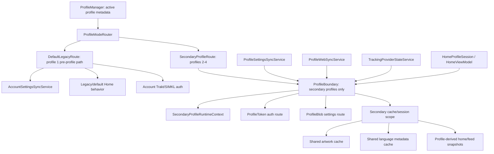

# Profile Boundary Rearchitecture Plan

## Overview

Refactor secondary-profile ownership into a single architectural boundary while preserving profile 1/default on the pre-profile legacy path. The current implementation distributes profile decisions across sync services, home state, auth stores, cache stores, and UI view models. That distribution is the root cause of repeated regressions where a fix for profile 2 breaks profile 1/default, or a profile 1 fix leaks state into profiles 2-4.

The target design is:

> Profile 1/default does not use `ProfileBoundary`. It uses the pre-profile legacy architecture for seamless upgrades. `ProfileBoundary` owns only non-default profiles 2-4. A small `ProfileModeRouter` is the only component allowed to choose between the legacy default path and the secondary-profile boundary; services may ask for a route, but may not infer ownership.

Implementation must not begin until this plan is approved.

## Problem Frame

Profiles are now two different product modes that share some infrastructure:

- Profile 1 is the legacy/default profile and must preserve pre-profile behavior exactly from checkpoint `52d8ac6650fd682c2f0d1652e15b72bcdd9a6121`.
- Profiles 2-4 are isolated profile identities and must not inherit profile 1 Trakt auth, SIMKL auth, catalog choices, Continue Watching, progress, or profile-local settings.
- Account-global integrations, installed addons, metadata providers, and addon inventory remain shared.
- Metadata and images may be shared only through explicit cache key contracts: images are profile/language-independent; text metadata is language-keyed and can coexist for multiple languages per item.

Recent bug fixes exposed that the code does not have a real secondary-profile ownership boundary or a hard default-profile bypass. Instead, every service decides locally whether profile 1 means account/default or whether profiles 2-4 mean profile blob/token. This creates contradictory behavior.

## Requirements Trace

- R1. Profile 1/default keeps the pre-profile architecture and behavior from checkpoint `52d8ac6650fd682c2f0d1652e15b72bcdd9a6121`, including legacy account-level Trakt/SIMKL auth, catalog config, addon rails, Continue Watching, and existing disk cache behavior.
- R2. Profiles 2-4 use profile-owned Trakt/SIMKL auth tokens and profile-owned catalog settings from Supabase/web.
- R3. Profiles 2-4 do not inherit profile 1 Trakt catalogs, Trakt auth, Continue Watching, or local state.
- R4. Account-global integrations and addons remain shared across all profiles.
- R5. Metadata cache sharing is explicit: image cache has no profile/language key; text metadata is language-keyed and preserves multiple languages per item.
- R6. Profile switches load the target profile's disk-backed state immediately and do not mutate other profile sessions from in-flight jobs.
- R7. The architecture has one owner for routing between legacy default and secondary profiles; `ProfileBoundary` owns only secondary profile routing/context, and services must not infer ownership.
- R8. `ProfileBoundary` is bidirectional: default legacy state cannot enter secondary routes, and secondary routes/jobs cannot read, clear, overwrite, or persist into default legacy state.
- R9. Contract tests prevent future distributed profile ownership decisions from reappearing.
- R10. Both profile 1/default legacy hydration and profiles 2-4 secondary hydration use the same shared metadata and artwork cache interfaces; `ProfileBoundary` scopes only secondary profile ownership and profile-derived snapshots, not shared metadata/artwork.

## Scope Boundaries

- This plan does not route profile 1/default through `ProfileBoundary`.
- This plan does not change product behavior for profile 1/default except restoring pre-profile behavior from checkpoint `52d8ac6650fd682c2f0d1652e15b72bcdd9a6121`.
- This plan does not make account-global integrations profile-local.
- This plan does not change Supabase schema unless implementation discovers missing constraints for existing owner routes.
- This plan does not install debug or release builds during planning.
- This plan does not implement code. It defines the approved shape for a later execution pass.

## Context & Research

### Relevant Code and Patterns

- `docs/architecture/profile-settings-scope.md` already defines many ownership rules, but code does not enforce a hard split between default legacy and secondary boundary paths.
- Git checkpoint `52d8ac6650fd682c2f0d1652e15b72bcdd9a6121` is the baseline for profile 1/default behavior before profile work began.
- `app/src/main/java/com/nexio/tv/core/profile/ProfileManager.kt` owns active profile metadata but does not own source-of-truth routing.
- `app/src/main/java/com/nexio/tv/core/sync/AccountSettingsSyncService.kt` contains account/default behavior and currently hardcodes primary profile assumptions.
- `app/src/main/java/com/nexio/tv/core/sync/ProfileSettingsSyncService.kt` owns profile settings blobs and currently guards profile 1 locally.
- `app/src/main/java/com/nexio/tv/core/sync/ProfileWebSyncService.kt` owns profile auth token sync and recently showed the failure mode: it cleared profile 1 Trakt/SIMKL auth when profile 1 had no `profile_auth_tokens`.
- `app/src/main/java/com/nexio/tv/data/repository/TrackingProviderStateService.kt` combines auth state but does not receive a typed profile context.
- `app/src/main/java/com/nexio/tv/ui/screens/home/HomeViewModel.kt` and `app/src/main/java/com/nexio/tv/ui/screens/home/HomeViewModelCatalogPipeline.kt` hold profile-sensitive home state in mutable fields updated by async collectors.
- `app/src/main/java/com/nexio/tv/data/local/HomeCatalogSnapshotStore.kt`, `SyntheticHomeCatalogStore.kt`, `TraktDiscoverySnapshotStore.kt`, `SimklDiscoverySnapshotStore.kt`, and `ContinueWatchingSnapshotStore.kt` already use profile-sensitive storage names, but callers still use global active-profile lookup during async work.
- `app/src/main/java/com/nexio/tv/data/local/MetadataDiskCacheStore.kt` and `app/src/main/java/com/nexio/tv/core/image/ArtworkImageCacheKeys.kt` represent the cache split that needs to be made explicit in architecture.

### Debug Evidence

- Runtime logs showed profile 1 auth being cleared by profile auth token sync:
  - `ProfileWebSyncService: Clearing stale local Trakt auth for profile 1; remote has no Trakt tokens`
  - `ProfileWebSyncService: Clearing stale local SIMKL auth for profile 1; remote has no SIMKL tokens`
- Runtime logs showed home state being reset multiple times for the same target profile after sync collectors and active profile collectors interleaved:
  - `Resetting profile-scoped home state reason=profile_switch:1`
  - `Resetting profile-scoped home state reason=profile_switch:2`
- Runtime logs showed Trakt clearing from several independent sources:
  - `tracking_auth_changed`
  - `observe_trakt_discovery_unauthenticated`
- SIMKL loading rows exposed a separate planner drift: descriptor generation treated enabled catalogs missing from saved order as enabled, while synthetic row construction emitted only rows present in `catalogOrder`.

### Institutional Learnings

- Existing profile isolation plan: `docs/plans/2026-04-15-002-refactor-profile-settings-isolation-plan.md`
- Existing scope contract: `docs/architecture/profile-settings-scope.md`
- Existing profile contract tests: `app/src/test/java/com/nexio/tv/sync/ProfileSettingsScopeContractTest.kt`

### External References

No external framework research is needed. This is an internal architecture ownership problem and the relevant failure modes are visible in local code/logs.

## Key Technical Decisions

- **Default legacy bypass:** Profile 1/default must not use `ProfileBoundary`. It follows the pre-profile architecture from checkpoint `52d8ac6650fd682c2f0d1652e15b72bcdd9a6121` for seamless migration.
- **Single secondary owner, no distributed inference:** Introduce `ProfileBoundary` as the only component allowed to decide ownership, source-of-truth route, cache scope, and active generation for profiles 2-4. Services may consume typed secondary route outputs only.
- **Bidirectional boundary:** The boundary must protect both sides. It must reject profile 1/default as an input, and any secondary route/generation it creates must be unable to target default legacy stores, snapshots, auth, catalog settings, or in-memory home state.
- **One mode router:** Introduce a small `ProfileModeRouter` that returns either `DefaultLegacyRoute` or `SecondaryProfileRoute`. It is the only place outside low-level storage naming helpers allowed to branch on default vs secondary profile mode.
- **Profile 1 is `DefaultLegacyRoute`:** Account/default sync, account auth, existing addon rails, Trakt/SIMKL catalogs, Continue Watching, and legacy disk cache behavior remain untouched by secondary-profile sync.
- **Profiles 2-4 are `SecondaryProfileRoute`:** Secondary profiles use profile settings blobs and profile auth tokens for profile-owned surfaces.
- **Home runs inside a profile session only for secondary profiles:** Secondary home state becomes generation-scoped. Profile 1 home behavior remains legacy and is protected by characterization tests before any refactor touches it.
- **Shared caches are not profile home snapshots:** Artwork and language-keyed metadata can be shared by both default legacy and secondary profiles; home/feed/catalog/progress snapshots are profile-derived and may not be shared.
- **Metadata cache keys are catalog-row addressable:** Text metadata keys use `meta::<itemKey>::<languageTag>::<providerToken>`, where `itemKey` is the catalog-row lookup key such as `series:tt0944947` or `movie:tt0816692`. This is structurally sound and must remain easy for catalog rows to query directly.
- **Artwork cache keys are language/profile independent:** Image keys are based on item id, provider tag, and artwork type only. They must stay reusable across profile 1/default and profiles 2-4.
- **Catalog rows come from one planner:** Descriptor and synthetic row construction must share one enabled/order/publishability decision source.

## Open Questions

### Resolved During Planning

- **Should profile ownership remain distributed across services?** No. Distributed ownership is the architectural bug.
- **Should profile 1 use `ProfileBoundary`?** No. Profile 1 is a legacy bypass and must keep the pre-profile architecture for seamless upgrade behavior.
- **Should profile 1 use profile auth tokens?** No. Profile 1 uses legacy account Trakt/SIMKL auth through account secrets/settings.
- **Should account-global metadata and image caches be shared?** Yes, with explicit key contracts: images no profile/language; text metadata includes language.
- **Should metadata keys include profile id?** No. The current `meta::<itemKey>::<languageTag>::<providerToken>` shape is structurally sound because it lets any catalog row look up metadata by item key while preserving multiple languages.

### Deferred to Implementation

- **Exact Kotlin names and package layout:** Deferred. The plan names intended components, but implementation should choose names consistent with local conventions.
- **Whether to split `CatalogDiskCacheStore`:** Deferred to Unit 6 research/implementation. It may need a raw account-global addon response cache separate from profile home snapshots.
- **Whether Supabase RPC/RLS changes are required:** Deferred until Android/web route audit confirms all existing APIs can express the contract.

## High-Level Technical Design

> This illustrates the intended approach and is directional guidance for review, not implementation specification. The implementing agent should treat it as context, not code to reproduce.



Directional API shape:

```text
ProfileModeRouter
  routeFor(profileId) -> DefaultLegacyRoute | SecondaryProfileRoute

ProfileBoundary  // secondary profiles only
  activeContext
  contextFor(profileId)
  authRoute(profileId, provider)
  settingsRoute(profileId, domain)
  cacheScope(profileId, cache, languageTag)
  isCurrent(generation)
```

Typed route outcomes:

```text
ProfileRoute = DefaultLegacyRoute | SecondaryProfileRoute(profileId)
AuthRoute = ProfileToken(profileId)                 // no AccountLegacy here
SettingsRoute = ProfileBlob(profileId)              // no AccountLegacy here
CacheScope = SharedArtwork | SharedLanguageMetadata(languageTag, providerToken) | ProfileSnapshot(profileId, languageTag)
```

## Cache Hydration Contract

This section is part of the architecture contract because cache sharing is the only intentional cross-profile data sharing in the profile system.

### Shared text metadata cache

`MetadataDiskCacheStore` stores text/title metadata in a shared disk cache, currently backed by `metadata_disk_cache_v1`.

Primary key shape:

```text
meta::<itemKey>::<languageTag>::<providerToken>
```

Examples:

```text
meta::series:tt0944947::nl::native
meta::series:tt0944947::en::native
meta::movie:tt0816692::en::rpdb:<token-hash>
```

The key dimensions are:

- `itemKey`: catalog-row addressable content key, normally `<type>:<id>` such as `series:tt0944947` or `movie:tt0816692`.
- `languageTag`: selected text metadata language, allowing Dutch and English metadata for the same item to coexist.
- `providerToken`: poster/rating/artwork provider token, allowing native/RPDB/TOP Posters variants to coexist.

Rules:

- Do not add profile id to metadata keys.
- Do not invalidate metadata globally when one profile changes language.
- Both profile 1/default legacy hydration and profiles 2-4 secondary hydration may read and write this shared cache.
- Profile-specific auth, progress, catalog visibility, and list membership must not be written into this shared metadata cache.

### Shared artwork/image cache

Artwork image disk keys are produced by `ArtworkImageCacheKeys`.

Current key shapes:

```text
<itemId>_<provider>_poster
<itemId>_native_background
<itemId>_native_logo
<itemId>_native_thumbnail
```

Examples:

```text
tt0944947_native_background
tt0944947_native_logo
id249854_tmdb_poster
```

Rules:

- Image keys must not include profile id.
- Image keys must not include language.
- Profile 1/default and profiles 2-4 should reuse the same image cache entries for the same item/artwork/provider.

### Profile-derived home/feed snapshots

Home and synthetic catalog snapshots are not shared metadata. They are profile-derived row state.

Current snapshot key shape:

```text
snapshot:p<profileId>:<languageTag>
```

Examples:

```text
snapshot:p1:nl
snapshot:p2:en
```

Rules:

- Profile 1/default reads legacy/default snapshot keys and stays outside `ProfileBoundary`.
- Profiles 2-4 read secondary profile snapshot keys through secondary session/cache scope.
- Home/feed snapshots may contain text and row ordering, so they must remain profile/language scoped.
- A secondary profile may hydrate row metadata/images from shared caches, but must not read or persist profile 1/default home snapshots.
- Profile 1/default may hydrate row metadata/images from shared caches, but must not enter `ProfileBoundary`.

## Implementation Units

- [ ] **Unit 1: Characterize default legacy behavior from checkpoint**

**Goal:** Capture profile 1/default pre-profile behavior before refactoring so the rearchitecture cannot silently change the upgrade path.

**Requirements:** R1, R4, R5, R8

**Dependencies:** None

**Files:**
- Test: `app/src/test/java/com/nexio/tv/sync/ProfileSettingsScopeContractTest.kt`
- Test: `app/src/test/java/com/nexio/tv/ui/screens/home/HomeProfileSessionTest.kt`
- Test: `app/src/test/java/com/nexio/tv/data/local/HomeCatalogSnapshotStoreTest.kt`
- Reference: checkpoint `52d8ac6650fd682c2f0d1652e15b72bcdd9a6121`

**Approach:**
- Use checkpoint `52d8ac6650fd682c2f0d1652e15b72bcdd9a6121` as the behavioral baseline for default profile startup/home/catalog/auth behavior.
- Add characterization tests that assert profile 1/default uses legacy account settings, account auth, account addon rails, and legacy disk-backed home behavior.
- Do not route profile 1 through `ProfileBoundary`.
- Treat these tests as the migration safety net for the rest of the refactor.

**Patterns to follow:**
- Current pre-profile account sync and home behavior from the checkpoint.
- Existing home snapshot store tests.

**Test scenarios:**
- Happy path: profile 1/default restores account Trakt catalog rows from legacy disk-backed snapshots without profile settings blobs.
- Happy path: profile 1/default restores Continue Watching from legacy/account auth behavior.
- Happy path: profile 1/default addon catalog rails render using account-installed addons.
- Edge case: missing profile 1 `profile_auth_tokens` does not clear Trakt/SIMKL auth.
- Integration: profile 1/default startup does not call profile settings/auth routes for Trakt/SIMKL catalog/auth ownership.

**Verification:**
- Profile 1/default baseline behavior is pinned before secondary boundary work starts.
- Later units may not regress the baseline tests.

- [ ] **Unit 2: Add ProfileModeRouter and secondary ProfileBoundary**

**Goal:** Create the single routing gate that preserves profile 1 as a legacy bypass and routes only profiles 2-4 into `ProfileBoundary`.

**Requirements:** R1, R2, R3, R4, R5, R7, R8

**Dependencies:** Unit 1

**Files:**
- Create: `app/src/main/java/com/nexio/tv/core/profile/ProfileModeRouter.kt`
- Create: `app/src/main/java/com/nexio/tv/core/profile/ProfileBoundary.kt`
- Create or modify: `app/src/main/java/com/nexio/tv/core/di/ProfileModule.kt`
- Test: `app/src/test/java/com/nexio/tv/core/profile/ProfileModeRouterTest.kt`
- Test: `app/src/test/java/com/nexio/tv/core/profile/ProfileBoundaryTest.kt`
- Test: `app/src/test/java/com/nexio/tv/sync/ProfileSettingsScopeContractTest.kt`

**Approach:**
- Add a typed route gate around profile mode.
- Keep `ProfileManager` responsible for profile list and active profile id only.
- `ProfileModeRouter` returns `DefaultLegacyRoute` for profile 1 and `SecondaryProfileRoute` for profiles 2-4.
- `ProfileBoundary` accepts only `SecondaryProfileRoute` and rejects/default-fails profile 1 usage.
- Add typed auth/settings/cache route outputs for secondary profiles only.
- Add a secondary active generation that increments whenever secondary profile context changes.

**Patterns to follow:**
- Existing profile state source in `app/src/main/java/com/nexio/tv/core/profile/ProfileManager.kt`
- Existing profile-aware store naming in `app/src/main/java/com/nexio/tv/data/local/ProfileDataStoreFactory.kt`
- Existing profile prefs naming in `app/src/main/java/com/nexio/tv/core/sync/ProfilePrefsName.kt`

**Test scenarios:**
- Happy path: profile id 1 maps to `DefaultLegacyRoute` and never enters `ProfileBoundary`.
- Happy path: profile ids 2-4 map to `SecondaryProfileRoute` and can enter `ProfileBoundary`.
- Edge case: invalid or missing profile id falls back predictably without granting profile 1 account routes to another id.
- Edge case: `ProfileBoundary` rejects or fails closed if asked to create a secondary route for profile 1.
- Edge case: a secondary route cannot produce cache/auth/settings targets with legacy/default store keys.
- Integration: active context generation increments on profile switch and does not increment when the same profile is re-emitted.
- Contract: direct default-profile routing checks outside `ProfileModeRouter`, low-level store naming helpers, and tests fail the architecture test.

**Verification:**
- Services can obtain default-vs-secondary mode only through `ProfileModeRouter`.
- Secondary services can obtain profile-owned routes only through `ProfileBoundary`.
- Profile 1/default is not a `ProfileBoundary` route.
- `ProfileBoundary` prevents leaks in both directions: no default-to-secondary leakage and no secondary-to-default mutation.

- [ ] **Unit 3: Route sync services through legacy bypass or secondary boundary**

**Goal:** Remove account-vs-profile routing decisions from sync services.

**Requirements:** R1, R2, R3, R4, R7, R8

**Dependencies:** Unit 1, Unit 2

**Files:**
- Modify: `app/src/main/java/com/nexio/tv/core/sync/StartupSyncService.kt`
- Modify: `app/src/main/java/com/nexio/tv/core/sync/AccountSettingsSyncService.kt`
- Modify: `app/src/main/java/com/nexio/tv/core/sync/ProfileSettingsSyncService.kt`
- Modify: `app/src/main/java/com/nexio/tv/core/sync/ProfileWebSyncService.kt`
- Test: `app/src/test/java/com/nexio/tv/core/sync/ProfileSettingsSyncServiceTest.kt`
- Test: `app/src/test/java/com/nexio/tv/sync/ProfileSettingsScopeContractTest.kt`

**Approach:**
- Replace local checks such as "primary profile" or "profile id 1" with `ProfileModeRouter` route requests.
- `AccountSettingsSyncService` remains the default legacy/account route owner and account-global integration owner.
- `ProfileSettingsSyncService` handles secondary `SettingsRoute.ProfileBlob` only.
- `ProfileWebSyncService` handles secondary `AuthRoute.ProfileToken` only.
- `StartupSyncService` orchestrates one route: `DefaultLegacyRoute` or `SecondaryProfileRoute`; it must not invoke both account and profile routes blindly for the same ownership domain.

**Patterns to follow:**
- Existing account snapshot flow in `AccountSettingsSyncService`.
- Existing profile blob helpers in `ProfileSettingsSyncService`.
- Existing profile auth token model in `ProfileWebSyncService`.

**Test scenarios:**
- Happy path: profile 1 startup pulls account settings/secrets and never queries `profile_auth_tokens` for Trakt/SIMKL.
- Happy path: profile 2 startup pulls profile settings blob and profile auth tokens.
- Edge case: profile 1 has no `profile_auth_tokens`; local account Trakt/SIMKL auth remains intact.
- Edge case: profile 2 has no `profile_auth_tokens`; local profile 2 Trakt/SIMKL auth is cleared.
- Edge case: a secondary profile sync route cannot clear or overwrite profile 1/default auth or settings even if Supabase has missing/empty secondary rows.
- Integration: switching from profile 2 to profile 1 restores account-owned auth/settings through account route only.
- Integration: switching from profile 1 to profile 2 cannot apply account Trakt/SIMKL settings to profile 2.

**Verification:**
- Sync logs and tests show one route per profile kind.
- Account sync and profile sync no longer duplicate profile ownership checks.

- [ ] **Unit 4: Convert auth/provider state to route-scoped reads**

**Goal:** Ensure tracking provider state, auth services, scrobble, library, and progress services operate on a profile context instead of global active-profile inference.

**Requirements:** R1, R2, R3, R6, R7

**Dependencies:** Unit 1, Unit 2, Unit 3

**Files:**
- Modify: `app/src/main/java/com/nexio/tv/data/repository/TrackingProviderStateService.kt`
- Modify: `app/src/main/java/com/nexio/tv/data/repository/TrackingProgressService.kt`
- Modify: `app/src/main/java/com/nexio/tv/data/repository/TrackingScrobbleService.kt`
- Modify: `app/src/main/java/com/nexio/tv/data/repository/LibraryRepositoryImpl.kt`
- Modify: `app/src/main/java/com/nexio/tv/data/repository/TraktAuthService.kt`
- Modify: `app/src/main/java/com/nexio/tv/data/repository/SimklAuthService.kt`
- Test: `app/src/test/java/com/nexio/tv/data/repository/TrackingWatchingNowRoutingTest.kt`
- Test: `app/src/test/java/com/nexio/tv/data/repository/WatchProgressRepositoryProviderRoutingTest.kt`
- Test: `app/src/test/java/com/nexio/tv/data/repository/LibraryRepositoryImplTest.kt`

- Services that need auth state should request a profile mode route first.
- Profile 1/default auth reads remain on the legacy account/auth path.
- Profiles 2-4 auth reads route through `ProfileBoundary` to profile token auth state.
- Avoid using default parameters that read `profileManager.activeProfileId.value` during async operations.

**Patterns to follow:**
- Existing `stateForProfile(profileId)` APIs on Trakt/SIMKL auth stores.
- Existing provider combination shape in `TrackingProviderStateService`.

**Test scenarios:**
- Happy path: profile 1 authenticated Trakt state remains true even when profile 1 has no profile token rows.
- Happy path: profile 2 unauthenticated Trakt state remains false even when profile 1 is authenticated.
- Edge case: a profile switch during an auth refresh cannot cause tokens to be saved to the wrong profile.
- Edge case: a secondary auth unlink/clear event cannot target profile 1/default auth stores.
- Integration: scrobble/progress mutations route to the active session provider and never profile 1 after switching to profile 2.

**Verification:**
- Auth, scrobble, library, and progress services use boundary-provided context or route.
- No async save/clear method relies on a default active profile id.

- [ ] **Unit 5: Introduce secondary HomeProfileSession and protect default legacy home**

**Goal:** Keep profile 1/default on the legacy home behavior while replacing secondary-profile mutable home globals with generation-scoped sessions.

**Requirements:** R1, R2, R3, R6, R7

**Dependencies:** Unit 1, Unit 2, Unit 4

**Files:**
- Modify: `app/src/main/java/com/nexio/tv/ui/screens/home/HomeViewModel.kt`
- Modify: `app/src/main/java/com/nexio/tv/ui/screens/home/HomeViewModelCatalogPipeline.kt`
- Modify: `app/src/main/java/com/nexio/tv/ui/screens/home/HomeViewModelContinueWatching.kt`
- Modify: `app/src/main/java/com/nexio/tv/data/local/HomeCatalogSnapshotStore.kt` if context injection is needed
- Modify: `app/src/main/java/com/nexio/tv/data/local/SyntheticHomeCatalogStore.kt` if context injection is needed
- Test: `app/src/test/java/com/nexio/tv/ui/screens/home/HomeProfileSessionTest.kt`
- Test: `app/src/test/java/com/nexio/tv/data/local/HomeCatalogSnapshotStoreTest.kt`
- Test: `app/src/test/java/com/nexio/tv/data/local/SyntheticHomeCatalogStoreTest.kt`

**Approach:**
- Preserve profile 1/default legacy home startup, disk snapshots, Trakt catalogs, addon rails, and Continue Watching behavior characterized in Unit 1.
- Create a secondary `HomeProfileSession` for profiles 2-4 only.
- Disk restore for the secondary session happens before any secondary network refresh.
- Every secondary collector/job captures session generation.
- Secondary state updates are ignored when generation is stale.
- Profile switch cancels secondary session-owned jobs and starts a new secondary session when the target is profiles 2-4.

**Patterns to follow:**
- Current profile switch handling in `HomeViewModel`.
- Existing snapshot store read/write shapes.
- Existing loading placeholder behavior in `ModernHomeRows`.

**Test scenarios:**
- Happy path: profile 1 startup displays disk-backed Trakt rows and Continue Watching before network refresh using the legacy path, not `HomeProfileSession`.
- Happy path: profile 2 startup displays its disk-backed profile catalog rows without profile 1 Trakt rows.
- Edge case: profile 1 refresh completes after switching to profile 2; profile 2 UI is unchanged.
- Edge case: profile 2 refresh completes after switching back to profile 1; profile 1 UI is unchanged.
- Edge case: a stale secondary generation cannot clear default profile Trakt rows, Continue Watching, addon rows, or legacy home snapshots.
- Integration: switching 1 -> 2 -> 1 restores each profile's own disk-backed home state immediately.
- Integration: repeated active-profile emissions for the same id do not reset the session or clear visible rows.

**Verification:**
- No secondary home update path mutates visible state without checking current generation.
- Default legacy visible rows survive unrelated secondary profile sync events.

- [ ] **Unit 6: Centralize secondary catalog planning and preserve default legacy catalog logic**

**Goal:** Use one planner for secondary expected keys, publishable keys, loading descriptors, synthetic rows, and addon rows while profile 1/default keeps legacy catalog logic.

**Requirements:** R1, R2, R3, R4, R6, R8

**Dependencies:** Unit 1, Unit 2, Unit 5

**Files:**
- Create: `app/src/main/java/com/nexio/tv/ui/screens/home/CatalogPlan.kt`
- Modify: `app/src/main/java/com/nexio/tv/ui/screens/home/HomeViewModelCatalogUtils.kt`
- Modify: `app/src/main/java/com/nexio/tv/ui/screens/home/HomeViewModelCatalogPipeline.kt`
- Test: `app/src/test/java/com/nexio/tv/ui/screens/home/CatalogPlanTest.kt`
- Test: `app/src/test/java/com/nexio/tv/sync/ProfileSettingsScopeContractTest.kt`

**Approach:**
- Move secondary catalog enable/order/publishability logic into one planner.
- Keep profile 1/default catalog planning on the legacy path unless a characterization test proves parity.
- Ensure Trakt/SIMKL enabled catalogs missing from saved order are still emitted after ordered enabled entries.
- Ensure profile-disabled keys apply only to the active session/profile.
- Loading descriptors are generated only for sources that are enabled and can be satisfied by a valid refresh route.
- Loading descriptors remain focusable but are not persisted as completed snapshots.

**Patterns to follow:**
- Existing descriptor functions in `HomeViewModelCatalogUtils`.
- Existing synthetic row builders in `HomeViewModelCatalogPipeline`.
- Existing loading placeholder behavior in `ModernHomeRows`.

**Test scenarios:**
- Happy path: profile 1 authenticated Trakt rows remain available through legacy account/default catalog logic.
- Happy path: profile 2 SIMKL rows are planned from profile SIMKL settings and profile discovery snapshots.
- Edge case: enabled Trakt/SIMKL catalog missing from `catalogOrder` still emits a populated row.
- Edge case: disabled catalog key hides a row only for that profile.
- Edge case: no auth route for Trakt means no Trakt rows and no Trakt loading descriptors.
- Integration: plan output writes no loading-only row to `HomeCatalogSnapshotStore`.

**Verification:**
- Descriptor and synthetic row logic no longer drift.
- Row planning tests cover profile 1 and profile 2 separately.

- [ ] **Unit 7: Make cache scope explicit**

**Goal:** Split cache ownership into shared artwork, shared language metadata, and profile-derived snapshots, and ensure both default legacy and secondary profiles hydrate through the correct cache contracts.

**Requirements:** R4, R5, R6, R8

**Dependencies:** Unit 1, Unit 2, Unit 5

**Files:**
- Modify: `docs/architecture/profile-settings-scope.md`
- Modify: `app/src/main/java/com/nexio/tv/data/local/MetadataDiskCacheStore.kt`
- Modify: `app/src/main/java/com/nexio/tv/core/image/ArtworkImageCacheKeys.kt`
- Modify: `app/src/main/java/com/nexio/tv/data/local/HomeCatalogSnapshotStore.kt`
- Modify: `app/src/main/java/com/nexio/tv/data/local/SyntheticHomeCatalogStore.kt`
- Test: `app/src/test/java/com/nexio/tv/data/local/MetadataDiskCacheStoreTest.kt`
- Test: `app/src/test/java/com/nexio/tv/core/image/ArtworkImageCacheKeysTest.kt`
- Test: `app/src/test/java/com/nexio/tv/data/local/HomeCatalogSnapshotStoreTest.kt`
- Test: `app/src/test/java/com/nexio/tv/data/local/SyntheticHomeCatalogStoreTest.kt`

**Approach:**
- Document and enforce that image keys exclude profile and language.
- Document and enforce that text metadata keys keep the catalog-row-addressable shape `meta::<itemKey>::<languageTag>::<providerToken>`.
- Document and enforce that metadata keys include language and provider/poster token, but not profile id.
- Document and enforce that home/feed snapshots include profile and language where text is present.
- Make it explicit that profile 1/default legacy hydration and secondary profile hydration use the same shared metadata/artwork cache interfaces.
- Make it explicit that `ProfileBoundary` must not fork, wrap, or profile-scope shared metadata/artwork caches; it only scopes secondary profile ownership and profile-derived snapshots.
- Decide whether `CatalogDiskCacheStore` needs to split raw account-global addon response cache from profile-rendered catalog row snapshots.

**Patterns to follow:**
- Existing `ArtworkImageCacheKeys` key tests.
- Existing metadata language-key tests.
- Existing snapshot store profile/language key tests.

**Test scenarios:**
- Happy path: profile 1 Dutch metadata and profile 2 English metadata coexist for the same item.
- Happy path: profile 1/default legacy home rows can hydrate metadata by `itemKey + languageTag + providerToken` without entering `ProfileBoundary`.
- Happy path: profile 2 secondary home rows can hydrate metadata by the same key shape without reading profile 1 home snapshots.
- Happy path: profile 1 and profile 2 use the same cached poster/backdrop/logo image key for the same item.
- Edge case: changing app language does not invalidate image cache.
- Edge case: switching profiles does not invalidate shared image cache.
- Edge case: a metadata entry written from profile 2 English does not overwrite profile 1 Dutch metadata for the same `itemKey`.
- Edge case: profile id is absent from metadata and artwork keys but present in home/feed snapshot keys.
- Integration: home snapshots remain profile/language scoped and do not borrow profile 1 row data for profile 2.
- Integration: both default legacy and secondary profile sessions can hydrate row cards from shared metadata/artwork caches while keeping home/feed/progress snapshots isolated.

**Verification:**
- Cache docs and tests clearly separate shared caches from profile-derived snapshots.
- Metadata/image cache behavior matches product intent.
- Catalog rows retain direct metadata lookup by `itemKey`.

- [ ] **Unit 8: Align web and Supabase with default legacy plus secondary boundary contract**

**Goal:** Ensure Android, `nexio-web`, and Supabase use the same owner model: default legacy bypass for profile 1 and secondary profile boundary for profiles 2-4.

**Requirements:** R1, R2, R3, R4, R7, R8

**Dependencies:** Unit 1, Unit 2, Unit 3, Unit 6

**Files:**
- Modify: `docs/architecture/profile-settings-scope.md`
- Inspect/modify: `nexio-web` profile and account store files
- Inspect/modify: `supabase/migrations`
- Test: Android contract tests in `app/src/test/java/com/nexio/tv/sync/ProfileSettingsScopeContractTest.kt`
- Test: web profile/account store tests where available

**Approach:**
- Profile 1 web surfaces must use account/default settings and account integrations; they must not call profile settings/auth token APIs for default-profile catalog/auth ownership.
- Profiles 2-4 web surfaces must use profile settings and profile auth token routes.
- Supabase tables/RPCs should preserve the same owner model.
- Android docs/tests should name the same owners as web/Supabase.

**Patterns to follow:**
- Existing Android scope matrix in `docs/architecture/profile-settings-scope.md`.
- Existing web profile store/account store split.
- Existing Supabase `profile_settings` and `profile_auth_tokens` tables.

**Test scenarios:**
- Integration: profile 1 web catalog changes sync to Android profile 1 account/default config.
- Integration: profile 2 web catalog changes sync to Android profile 2 and do not affect profile 1.
- Integration: profile 2 auth unlink clears profile 2 local auth and does not affect profile 1.
- Integration: account addon install appears as available source for all profiles, but visibility/order remains profile-specific.

**Verification:**
- The same owner matrix is enforced across Android, web, and Supabase.
- No platform has a separate interpretation of profile 1 vs profiles 2-4.

## System-Wide Impact

- **Interaction graph:** Profile switching affects `ProfileManager`, `ProfileBoundary`, sync services, auth stores, home sessions, discovery stores, progress stores, catalog planning, web profile stores, and Supabase profile/account tables.
- **Error propagation:** Missing profile token rows are only errors/clear signals for `AuthRoute.ProfileToken`, never for `AuthRoute.AccountLegacy`.
- **State lifecycle risks:** In-flight refreshes are currently able to update stale profiles. Generation-scoped sessions mitigate this.
- **API surface parity:** Android and web must expose the same source-of-truth routes for account/default vs secondary profiles.
- **Integration coverage:** Unit tests alone are insufficient. Profile switch and startup scenarios must be covered as cross-layer tests.
- **Unchanged invariants:** Account-global integrations and installed addons remain shared. Metadata/artwork cache sharing remains allowed only by explicit key contract.

## Risks & Dependencies

| Risk | Mitigation |
|------|------------|
| Reintroducing direct `profileId == 1` checks outside the owner | Add source contract tests that allow direct checks only in `ProfileBoundary`, low-level store naming helpers, and tests. |
| Breaking profile 1 legacy behavior during migration | Characterization tests for profile 1 startup, Trakt catalogs, Continue Watching, and addon rails before refactoring. |
| Breaking profiles 2-4 isolation | Cross-profile switch tests and profile-token/profile-blob route tests. |
| Async jobs mutating stale profile sessions | Generation-scoped `HomeProfileSession` updates. |
| Over-sharing metadata/progress data | Explicit cache scope classes and key-shape tests. |
| Web/Android/Supabase disagreement | Update architecture doc and add platform contract tests where possible. |

## Documentation / Operational Notes

- Update `docs/architecture/profile-settings-scope.md` as part of implementation, not after.
- Keep this plan as the implementation approval artifact.
- Do not ship partial patches that route only one service through `ProfileBoundary`; that preserves distributed ownership.
- Release verification must use release builds only.

## Sources & References

- Existing scope contract: `docs/architecture/profile-settings-scope.md`
- Existing profile isolation plan: `docs/plans/2026-04-15-002-refactor-profile-settings-isolation-plan.md`
- Relevant Android profile code: `app/src/main/java/com/nexio/tv/core/profile/ProfileManager.kt`
- Relevant account sync code: `app/src/main/java/com/nexio/tv/core/sync/AccountSettingsSyncService.kt`
- Relevant profile settings sync code: `app/src/main/java/com/nexio/tv/core/sync/ProfileSettingsSyncService.kt`
- Relevant profile auth sync code: `app/src/main/java/com/nexio/tv/core/sync/ProfileWebSyncService.kt`
- Relevant home code: `app/src/main/java/com/nexio/tv/ui/screens/home/HomeViewModel.kt`
- Relevant home pipeline: `app/src/main/java/com/nexio/tv/ui/screens/home/HomeViewModelCatalogPipeline.kt`
- Relevant metadata cache: `app/src/main/java/com/nexio/tv/data/local/MetadataDiskCacheStore.kt`
- Relevant image cache keys: `app/src/main/java/com/nexio/tv/core/image/ArtworkImageCacheKeys.kt`
