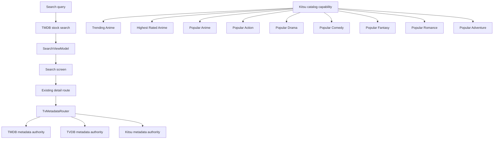

# feat: Reframe Stock Metadata Providers and Discovery

## Overview

The current worktree at `codex/tmdb-primary-search-catalogs` adds valuable TMDB-backed stock search and stock catalogs, but it frames TMDB too broadly. The product model should be:

- **TMDB** remains the primary stock search provider
- **TVDB** remains a metadata enrichment provider for TV content
- **Kitsu** remains a metadata enrichment provider for mapped anime content
- **Kitsu** also gains stock anime discovery rails, available in catalogs/settings but disabled by default

This plan keeps TMDB as the only stock search provider, preserves TVDB/Kitsu metadata-enrichment roles, and adds the requested Kitsu discovery rails without broadening stock search to TVDB or Kitsu.

## Problem Frame

The current TMDB branch is directionally right for stock search, but the framing "TMDB as the primary metadata/search source" is wrong. Nexio's stock metadata experience is composed of multiple built-in providers with distinct responsibilities:

- TMDB for stock search and broad discovery rails
- TVDB for TV-first metadata authority
- Kitsu for mapped anime metadata authority

If we treat TMDB as globally primary, we will hard-code the wrong assumptions into:

- search orchestration
- synthetic home catalog persistence
- settings and sync copy
- provider capability modeling
- Kitsu public/auth behavior

The correction is not to make search fan out across all providers. That would create more ambiguity. The correction is to model provider responsibilities explicitly while keeping TMDB as the stock search authority.

## Requirements Trace

- R1. Nexio's stock metadata model must explicitly treat TMDB, TVDB, and Kitsu as built-in providers with distinct responsibilities.
- R2. TMDB and TVDB must work by default through built-in developer credentials when present, with user overrides still supported.
- R3. Kitsu must work in baseline public mode without requiring auth for mapped metadata/discovery behavior that is meant to be stock.
- R4. TMDB must remain the primary stock search provider.
- R5. TVDB and Kitsu must remain metadata enrichment providers in this pass, not peer stock search providers.
- R6. Existing addon-backed search must continue to coexist with TMDB-backed stock search.
- R7. Metadata routing must continue to respect current authority by content shape: TMDB for movie/general fallback, TVDB for TV-first metadata, Kitsu for mapped anime metadata.
- R8. The stock-home/discovery system must stop baking in "TMDB is the only stock metadata provider" assumptions. Provider capabilities should be explicit even though TMDB remains the search authority.
- R9. TMDB stock catalogs already added in the worktree must continue to work after the refactor, including refresh, persistence, and settings wiring.
- R10. The provider model changes must avoid stale rows, duplicate fetches, and broken settings persistence during migration from the TMDB-only branch work.
- R11. Kitsu public metadata planning must explicitly account for the high-value public metadata surfaces that matter to Nexio, especially `/anime`, `/anime/{id}`, `/episodes`, `/episodes/{id}`, `/mappings`, `/media-relationships`, `/franchises`, `/installments`, `/categories`, `/streaming-links`, `/anime-characters`, `/characters`, `/anime-productions`, `/anime-staff`, `/castings`, `/people`, and `/trending/anime`.
- R12. Nexio should expose Kitsu-backed stock catalog feeds for anime discovery through the catalogs view.
- R13. Kitsu stock catalog feeds in scope are:
  - Trending Anime -> `/trending/anime`
  - Highest Rated Anime -> `/anime?sort=ratingRank`
  - Popular Anime -> `/anime?sort=popularityRank`
  - Popular Action Anime -> `/anime?filter[categories]=action&sort=popularityRank`
  - Popular Drama Anime -> `/anime?filter[categories]=drama&sort=popularityRank`
  - Popular Comedy Anime -> `/anime?filter[categories]=comedy&sort=popularityRank`
  - Popular Fantasy Anime -> `/anime?filter[categories]=fantasy&sort=popularityRank`
  - Popular Romance Anime -> `/anime?filter[categories]=romance&sort=popularityRank`
  - Popular Adventure Anime -> `/anime?filter[categories]=adventure&sort=popularityRank`
- R14. These Kitsu catalog feeds must be available but disabled by default.
- R15. `GET /trending/anime` should be treated as an explicit Kitsu discovery route, while the sort/filter-based rails should be treated as validated composed `/anime` queries whose semantics must be confirmed during implementation.

## Scope Boundaries

- Do not replace addon-backed search, Cinemeta search, or Android TV native search.
- Do not redesign detail navigation or playback launch.
- Do not broaden stock search to TVDB or Kitsu in this pass.
- Do not invent TVDB stock discovery rails in this pass.
- Kitsu discovery rails are in scope only for the specific anime feeds listed above.
- Do not add Kitsu social/community feeds such as favorites, follows, reviews, posts, comments, stats, or media reactions in this pass.
- Do not collapse all provider results into one deduplicated global stock search row.
- Do not turn Kitsu auth into a prerequisite for public mapped-anime metadata/discovery behavior.
- Do not rewrite the existing TVDB/TMDB/Kitsu metadata authority model from scratch; extend and codify it.

## Context & Research

### Relevant Code and Patterns

- `app/src/main/java/com/nexio/tv/ui/screens/search/SearchViewModel.kt` currently drives in-app search through addon-backed `CatalogRepository` flows and IMDb suggestions. In the TMDB worktree it already grows a provider-backed branch via `TmdbDiscoveryService` and `TmdbCatalogSettingsDataStore`.
- `app/src/main/java/com/nexio/tv/core/tvdb/TvMetadataRouter.kt` already models metadata authority across TMDB, TVDB, and Kitsu. It is the strongest local expression of provider precedence and should remain the source of truth for metadata authority.
- `app/src/main/java/com/nexio/tv/core/anime/KitsuMetadataService.kt` currently resolves mapped anime metadata through Kitsu without requiring an authenticated token; it passes a bearer token only when available.
- `app/src/main/java/com/nexio/tv/data/repository/KitsuAuthService.kt` in the worktree already distinguishes `providerEnabled()` and `providerAuthenticated()`, which is useful for separating public capability from account-only capability.
- `app/src/main/java/com/nexio/tv/core/metadata/MetadataApiKeyResolver.kt` and `app/src/main/java/com/nexio/tv/core/metadata/MetadataProviderConfig.kt` already support built-in TMDB/TVDB credentials plus user overrides.
- `app/src/main/java/com/nexio/tv/data/local/TmdbSettingsDataStore.kt` and `app/src/main/java/com/nexio/tv/data/local/TvdbSettingsDataStore.kt` default to enabled, but both `setEnabled(enabled)` implementations currently write `true` unconditionally. The provider-capability refactor should not preserve that ambiguity.
- `app/src/main/java/com/nexio/tv/data/remote/api/KitsuApi.kt` currently supports anime and episode fetches but not the requested discovery/catalog queries. Kitsu discovery support will require API expansion.
- `app/src/main/java/com/nexio/tv/data/remote/api/TvdbApi.kt` already exposes TVDB title search and remote-id search, but TVDB search is intentionally not being added to stock search in this pass.
- The TMDB worktree introduces `TmdbDiscoveryService`, `TmdbDiscoveryModels`, `TmdbCatalogSettingsDataStore`, and extensive home-pipeline wiring in `HomeViewModelCatalogPipeline.kt`, `HomeViewModelCatalogUtils.kt`, and `SyntheticHomeCatalogStore.kt`. Those are the main files to generalize away from TMDB-only framing while keeping TMDB search semantics intact.

### Institutional Learnings

- No `docs/solutions/` notes were found for this exact provider-framing/discovery problem.

### External References

- No external research was needed for planning. The repo already has strong local patterns for provider routing, built-in credential resolution, synthetic home rows, and TMDB-backed stock search.

## Key Technical Decisions

- **Keep metadata authority and search authority separate.**  
  `TvMetadataRouter` already models metadata authority by content shape. Stock search should remain narrower: TMDB is the stock search authority in this pass.

- **Model stock providers as a capability set, not a single primary source.**  
  The capability model should describe which provider participates in:
  - stock search
  - metadata authority
  - discovery rails
  - public vs authenticated behavior

- **Keep TMDB as the only stock search provider in this pass.**  
  The user clarified that widening stock search to TVDB and Kitsu would be messy and is not desired now.

- **Add Kitsu discovery rails without turning Kitsu into a stock search provider.**  
  Kitsu should gain the requested anime rails as catalog feeds, not as provider-backed search rows.

- **Codify Kitsu public access as baseline stock behavior.**  
  Kitsu auth should enhance capability when available, not gate public mapped metadata/discovery behavior.

- **Treat Kitsu sort/filter rails as validated composed queries, not guaranteed endpoint contracts.**  
  `/trending/anime` is explicit and safe to plan confidently. The `/anime?sort=...` and `/anime?filter[categories]=...` rails should be implemented only after validating the query contract.

## Open Questions

### Resolved During Planning

- **Should stock search fan out across TMDB, TVDB, and Kitsu?**  
  No. TMDB remains the primary stock search provider.

- **Should TVDB gain stock discovery rails now?**  
  No.

- **Should Kitsu gain stock discovery rails now?**  
  Yes, but only for the explicitly requested anime rails, and disabled by default.

- **Should external research drive the provider model?**  
  No. Local repo patterns are sufficient for this plan.

### Deferred to Implementation

- The exact Kitsu `/anime` sort fields for highest-rated and most-popular rails, and whether `ratingRank` / `popularityRank` need fallback handling.
- The exact Kitsu category filter contract for `filter[categories]`, including whether category names need slug or ID normalization.
- The exact paging and result-limit strategy for Kitsu rails so they remain responsive alongside existing TMDB discovery behavior.
- Whether Kitsu franchise, installment, relationship, character, staff, production, category, and streaming-link routes should be consumed now or only prepared as future-ready extension surfaces.

## High-Level Technical Design

> *This illustrates the intended approach and is directional guidance for review, not implementation specification. The implementing agent should treat it as context, not code to reproduce.*

For this plan's intended shape:

- TMDB: stock search + stock discovery rails
- TVDB: metadata authority only in this pass
- Kitsu: mapped metadata authority + anime discovery rails

## Implementation Units

- [ ] **Unit 1: Introduce an explicit stock-provider capability model**

**Goal:** Remove the implicit "TMDB is the stock provider" assumption from provider-backed search/catalog code and replace it with an explicit built-in provider capability model.

**Requirements:** R1, R2, R7, R8, R9, R10

**Dependencies:** None

**Files:**
- Create: `app/src/main/java/com/nexio/tv/core/metadata/StockMetadataProvider.kt`
- Create: `app/src/main/java/com/nexio/tv/core/metadata/StockMetadataProviderCapabilities.kt`
- Modify: `app/src/main/java/com/nexio/tv/core/metadata/MetadataApiKeyResolver.kt`
- Modify: `app/src/main/java/com/nexio/tv/core/tvdb/TvMetadataRouter.kt`
- Modify: `app/src/main/java/com/nexio/tv/data/repository/KitsuAuthService.kt`
- Modify: `app/src/main/java/com/nexio/tv/data/local/TmdbSettingsDataStore.kt`
- Modify: `app/src/main/java/com/nexio/tv/data/local/TvdbSettingsDataStore.kt`
- Test: `app/src/test/java/com/nexio/tv/core/metadata/StockMetadataProviderCapabilitiesTest.kt`
- Test: `app/src/test/java/com/nexio/tv/core/tvdb/TvMetadataRouterTest.kt`

**Approach:**
- Add a small capability model that describes, per provider:
  - default availability mode
  - stock search participation
  - metadata authority participation
  - discovery rail participation
- Reuse `MetadataApiKeyResolver` for TMDB/TVDB availability.
- Explicitly model Kitsu public capability separately from authenticated capability.
- Keep `TvMetadataRouter` as the metadata authority router, but update surrounding language and entry points so provider selection is framed as capability-based, not TMDB-primary.
- Fix or deliberately retire the misleading TMDB/TVDB `setEnabled(enabled)` semantics so the settings layer expresses the same contract as the rest of the system.

**Patterns to follow:**
- `app/src/main/java/com/nexio/tv/core/tvdb/TvMetadataRouter.kt`
- `app/src/main/java/com/nexio/tv/core/metadata/MetadataApiKeyResolver.kt`
- `app/src/main/java/com/nexio/tv/data/repository/KitsuAuthService.kt`

**Test scenarios:**
- Happy path: TMDB and TVDB built-in keys present -> both providers report stock capability without user configuration.
- Happy path: Kitsu unauthenticated but public-capable -> provider reports metadata/discovery capability where public access is allowed.
- Edge case: TMDB or TVDB custom credential missing but built-in key present -> capability remains available.
- Edge case: TVDB marked invalid -> provider capability falls back appropriately without claiming normal authority.
- Edge case: toggling TMDB/TVDB enabled state behaves consistently with the chosen stock-provider contract instead of silently forcing `true`.
- Integration: `TvMetadataRouter` still routes mapped anime to Kitsu, TV-first records to TVDB, and movie/general fallback to TMDB.

**Verification:**
- Capability tests prove the stock-provider set is explicit and downstream code no longer needs to infer TMDB primacy.

- [ ] **Unit 2: Add Kitsu stock discovery adapters and catalog definitions**

**Goal:** Add the requested Kitsu anime discovery rails, backed by public Kitsu endpoints and disabled-by-default catalog settings.

**Requirements:** R3, R11, R12, R13, R14, R15

**Dependencies:** Unit 1

**Files:**
- Create: `app/src/main/java/com/nexio/tv/data/repository/KitsuDiscoveryService.kt`
- Create: `app/src/main/java/com/nexio/tv/data/repository/KitsuDiscoveryModels.kt`
- Create: `app/src/main/java/com/nexio/tv/data/local/KitsuCatalogSettingsDataStore.kt`
- Modify: `app/src/main/java/com/nexio/tv/data/remote/api/KitsuApi.kt`
- Modify: `app/src/main/java/com/nexio/tv/core/di/RepositoryModule.kt`
- Test: `app/src/test/java/com/nexio/tv/data/repository/KitsuDiscoveryServiceTest.kt`
- Test: `app/src/test/java/com/nexio/tv/data/local/KitsuCatalogSettingsDataStoreTest.kt`

**Approach:**
- Mirror the `TmdbDiscoveryService` catalog-fetching pattern, but scope it to Kitsu anime rails only.
- Add catalog definitions for:
  - Trending Anime -> `/trending/anime`
  - Highest Rated Anime -> `/anime?sort=ratingRank`
  - Popular Anime -> `/anime?sort=popularityRank`
  - Popular Action/Drama/Comedy/Fantasy/Romance/Adventure Anime -> `/anime?filter[categories]=<category>&sort=popularityRank`
- Map results through existing anime ID/mapping conventions so detail routing and metadata fetches remain aligned.
- Keep all Kitsu rails disabled by default through a dedicated settings store.
- Structure the Kitsu public client so the same surface can support future metadata work against `/mappings`, `/media-relationships`, `/franchises`, `/installments`, `/categories`, `/streaming-links`, `/anime-characters`, `/characters`, `/anime-productions`, `/anime-staff`, `/castings`, and `/people`.

**Patterns to follow:**
- `app/src/main/java/com/nexio/tv/data/repository/TmdbDiscoveryService.kt`
- `app/src/main/java/com/nexio/tv/data/repository/TmdbDiscoveryModels.kt`
- `app/src/main/java/com/nexio/tv/core/anime/KitsuMetadataService.kt`

**Test scenarios:**
- Happy path: `/trending/anime` returns a populated Kitsu catalog row.
- Happy path: `ratingRank` and `popularityRank` queries return mapped anime previews.
- Happy path: category-filtered popularity queries for action, drama, comedy, fantasy, romance, and adventure return separate mapped rows.
- Edge case: a Kitsu rail returns sparse artwork or no runtime -> preview still maps safely.
- Edge case: one Kitsu rail fails while others succeed -> only the failed rail is empty.
- Error path: a sort/filter contract is unsupported or unstable -> that rail fails closed and remains disabled/empty.
- Integration: disabled-by-default Kitsu catalog preferences do not surface these rails until enabled.

**Verification:**
- Kitsu discovery tests prove the requested rails can be fetched, mapped, and toggled independently of TMDB search.

- [ ] **Unit 3: Preserve TMDB-only stock search while codifying three-provider framing**

**Goal:** Keep `SearchViewModel` and stock search explicitly TMDB-backed, while removing code and copy assumptions that TMDB is the only stock metadata provider.

**Requirements:** R4, R5, R6, R8, R9

**Dependencies:** Unit 1

**Files:**
- Modify: `app/src/main/java/com/nexio/tv/ui/screens/search/SearchViewModel.kt`
- Modify: `app/src/main/java/com/nexio/tv/ui/screens/search/SearchUiState.kt`
- Test: `app/src/test/java/com/nexio/tv/ui/screens/search/SearchViewModelTmdbTest.kt`

**Approach:**
- Keep direct `TmdbDiscoveryService.search(...)` usage as the stock search path.
- Update naming, comments, and surrounding wiring so the code clearly expresses:
  - TMDB is the stock search provider
  - TVDB and Kitsu are still stock metadata providers
- Keep addon-backed search visually and logically separate from TMDB search.
- Preserve cancellation and stale-query protections already present in `SearchViewModel`.
- Leave IMDb suggestion behavior intact unless TMDB stock search already supersedes it cleanly.

**Patterns to follow:**
- `app/src/main/java/com/nexio/tv/ui/screens/search/SearchViewModel.kt`
- `app/src/main/java/com/nexio/tv/data/repository/TmdbDiscoveryService.kt`

**Test scenarios:**
- Happy path: TMDB search still returns the stock search row and coexists with addon-backed search.
- Edge case: query changes mid-flight -> stale TMDB rows are discarded.
- Error path: TMDB search failure does not affect addon-backed rows.
- Integration: no TVDB or Kitsu stock search rows are introduced.

**Verification:**
- Search tests prove TMDB remains the sole stock search provider while the broader stock-provider framing is preserved.

- [ ] **Unit 4: Reframe synthetic home catalog plumbing for TMDB and Kitsu rails**

**Goal:** Keep the existing TMDB stock home catalogs from the worktree, add the requested Kitsu anime rails, and move their persistence/planning logic under the new stock-provider framing.

**Requirements:** R8, R9, R10, R12, R13, R14

**Dependencies:** Unit 2, Unit 3

**Files:**
- Modify: `app/src/main/java/com/nexio/tv/ui/screens/home/HomeViewModel.kt`
- Modify: `app/src/main/java/com/nexio/tv/ui/screens/home/HomeViewModelCatalogPipeline.kt`
- Modify: `app/src/main/java/com/nexio/tv/ui/screens/home/HomeViewModelCatalogUtils.kt`
- Modify: `app/src/main/java/com/nexio/tv/ui/screens/home/CatalogPlan.kt`
- Modify: `app/src/main/java/com/nexio/tv/data/local/SyntheticHomeCatalogStore.kt`
- Modify: `app/src/main/java/com/nexio/tv/core/recommendations/AndroidTvFeedCatalogService.kt`
- Test: `app/src/test/java/com/nexio/tv/ui/screens/home/HomeViewModelTmdbCatalogPlanTest.kt`
- Test: `app/src/test/java/com/nexio/tv/data/local/SyntheticHomeCatalogStoreTest.kt`
- Test: `app/src/test/java/com/nexio/tv/core/recommendations/AndroidTvFeedCatalogServiceTmdbTest.kt`

**Approach:**
- Keep TMDB as the broad stock discovery provider.
- Add Kitsu anime rails alongside TMDB, with Kitsu rails disabled by default and stored distinctly from TMDB discovery groups.
- Convert TMDB-specific storage/planning hooks into provider-capability-aware structures so Kitsu rails can plug in now and additional providers can be added later without another rewrite.
- Preserve the stale-row clearing, preference gating, and refresh hardening already landed in the worktree.

**Patterns to follow:**
- `app/src/main/java/com/nexio/tv/data/local/SyntheticHomeCatalogStore.kt`
- `app/src/main/java/com/nexio/tv/ui/screens/home/HomeViewModelCatalogPipeline.kt`
- TMDB worktree commits `208c26a4b`, `351b11535`, `5cca98a2f`, `4407f111d`, and `fd6d67156`

**Test scenarios:**
- Happy path: TMDB enabled catalogs still restore and refresh under the refactored provider-capability structure.
- Happy path: Kitsu anime rails are present in provider-scoped catalog settings and remain disabled by default.
- Happy path: enabling a Kitsu anime rail adds it to the synthetic/provider-backed home flow without disturbing TMDB rails.
- Edge case: TMDB preferences change -> stale TMDB groups are discarded and rebuilt correctly.
- Edge case: Kitsu catalog preferences change -> only Kitsu synthetic/provider groups refresh.
- Edge case: TMDB source unavailable -> TMDB synthetic rows clear without disturbing non-TMDB home content.
- Edge case: Kitsu sort-backed rails are unavailable -> those Kitsu groups clear or remain absent without disturbing TMDB content.

**Verification:**
- Existing TMDB catalog tests still pass after the framing refactor, and store/pipeline semantics remain stable.

- [ ] **Unit 5: Align settings, sync, and copy with the corrected provider model**

**Goal:** Ensure user-facing settings and synced state describe the real provider model: TMDB as stock search provider, TVDB/Kitsu as metadata providers, and Kitsu anime rails as disabled-by-default discovery feeds.

**Requirements:** R1, R2, R3, R4, R8, R14

**Dependencies:** Unit 1, Unit 2, Unit 4

**Files:**
- Modify: `app/src/main/java/com/nexio/tv/ui/screens/settings/TmdbSettingsScreen.kt`
- Modify: `app/src/main/java/com/nexio/tv/ui/screens/settings/TmdbSettingsViewModel.kt`
- Create: `app/src/main/java/com/nexio/tv/ui/screens/settings/KitsuCatalogSettingsScreen.kt`
- Create: `app/src/main/java/com/nexio/tv/ui/screens/settings/KitsuCatalogSettingsViewModel.kt`
- Modify: `app/src/main/java/com/nexio/tv/core/sync/AccountSettingsSyncService.kt`
- Modify: `app/src/main/java/com/nexio/tv/data/remote/supabase/AccountSyncModels.kt`
- Modify: `app/src/main/res/values/strings.xml`
- Test: `app/src/test/java/com/nexio/tv/ui/screens/settings/TmdbSettingsViewModelTest.kt`
- Test: `app/src/test/java/com/nexio/tv/ui/screens/settings/KitsuCatalogSettingsViewModelTest.kt`
- Test: `app/src/test/java/com/nexio/tv/core/sync/AccountConfigSyncContractTest.kt`

**Approach:**
- Update copy and settings semantics so TMDB stock catalogs are clearly "TMDB provider discovery rails" and TMDB remains the primary stock search provider.
- Add Kitsu catalog settings for:
  - Trending Anime
  - Highest Rated Anime
  - Most Popular Anime
  - Popular Action
  - Popular Drama
  - Popular Comedy
  - Popular Fantasy
  - Popular Romance
  - Popular Adventure
  all disabled by default.
- Avoid implying that TVDB or Kitsu participate in stock search.
- Avoid implying that Kitsu public capability requires auth.
- Update synced state only where necessary to preserve provider capability preferences and avoid contract drift.

**Patterns to follow:**
- `app/src/main/java/com/nexio/tv/core/sync/AccountSettingsSyncService.kt`
- `app/src/main/java/com/nexio/tv/data/remote/supabase/AccountSyncModels.kt`
- `app/src/main/java/com/nexio/tv/ui/screens/settings/TmdbSettingsScreen.kt`

**Test scenarios:**
- Happy path: TMDB settings still round-trip and remain editable.
- Happy path: Kitsu catalog feed settings round-trip and default to disabled.
- Edge case: old synced settings payloads still deserialize without losing TMDB stock catalog preferences.
- Edge case: old synced settings payloads upgrade without incorrectly enabling Kitsu anime rails.
- Edge case: Kitsu enabled but unauthenticated does not render copy incorrectly.
- Integration: settings/sync copy reflects TMDB-as-search-provider and Kitsu-as-catalog-provider without changing unrelated settings behavior.

**Verification:**
- Settings and sync tests prove the corrected framing is durable and backward compatible.

## System-Wide Impact

- **Interaction graph:** `SearchViewModel` stays TMDB-search-backed; `TvMetadataRouter` remains the metadata authority layer; `HomeViewModelCatalogPipeline` keeps TMDB discovery rails and gains Kitsu anime rails under a generic provider-capability model.
- **Error propagation:** TMDB search failures should collapse to empty TMDB search rows, not search-screen failures. TMDB and Kitsu catalog refresh failures should remain isolated to their own synthetic/provider groups.
- **State lifecycle risks:** The current TMDB worktree already deals with stale synthetic rows and preference drift; the refactor must preserve those guarantees while widening the conceptual model and adding provider-specific Kitsu catalog state.
- **API surface parity:** Search, settings, and account-sync layers all need to use the same provider-capability vocabulary to avoid another split-brain implementation.
- **Integration coverage:** The highest-risk integration paths are TMDB search authority semantics, stale synthetic row cleanup, Kitsu public-mode semantics, and Kitsu sort/filter rail validity.
- **Unchanged invariants:** Addon-backed search stays intact. Playback/autoplay flows are unchanged. TVDB remains the TV-first metadata authority; TMDB remains movie/general fallback; Kitsu remains mapped-anime authority. Kitsu social/community routes remain unused.

## Risks & Dependencies

| Risk | Mitigation |
|------|------------|
| Future work mistakenly broadens stock search to TVDB/Kitsu because the capability model is too generic | Keep TMDB search authority explicit in code, copy, and tests |
| TMDB-only worktree logic remains semantically "primary provider" even after reframing | Introduce an explicit capability model first and thread it through search/home code before adding Kitsu rails |
| Kitsu public metadata/discovery semantics regress back to auth-only behavior | Add tests that pin unauthenticated baseline capability and separate `providerEnabled` from `providerAuthenticated` |
| Stock-provider copy diverges from actual routing behavior | Align settings/sync copy in the same pass as capability model changes, not later |
| Kitsu sort-backed catalog assumptions are wrong or unstable | Treat sort/filter rails as implementation-validated composed queries, keep them disabled by default, and fail closed if the contract is weak |

## Documentation / Operational Notes

- This plan intentionally treats the existing TMDB worktree as the implementation baseline rather than replacing it. The right execution path is to continue on `codex/tmdb-primary-search-catalogs` while correcting the framing.
- Kitsu anime catalog rails are intentionally included here because they were explicitly requested. Broader TVDB discovery rails, Kitsu stock search, or Kitsu social/community rails should be planned separately if needed later.

## Sources & References

- Related prior requirements: `docs/brainstorms/2026-04-15-android-tv-native-search-requirements.md`
- Related prior plan: `docs/plans/2026-04-15-003-feat-android-tv-native-search-plan.md`
- Related provider-precedence requirements: `docs/brainstorms/2026-04-14-tvdb-first-class-tv-metadata-requirements.md`
- Related branch: `codex/tmdb-primary-search-catalogs`
- Related commits: `2639be14f`, `f1c6153ae`, `19e6c28ee`, `c10df0466`, `b46039dc0`, `c04f3e416`, `fd6d67156`
