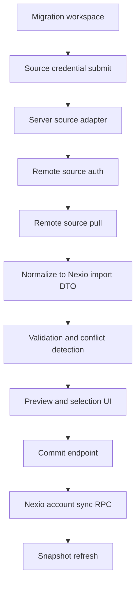

# Portal Migration Import Architecture

## Goal
Build a secure, account-native migration workspace in Nexio web that imports from Stremio and Nuvio using credentials and provider APIs, then commits into the existing Nexio account sync model.

## Scope
- Source A: Stremio credential login and authenticated pull.
- Source B: Nuvio credential login and authenticated pull.
- Importable domains for MVP:
  - Addons only
- Out of scope for MVP:
  - Library and watched history migration
  - Watch progress migration
  - Generic integration setting migration
  - Trakt token migration from source exports
  - Direct token export to client
  - Full parity for every legacy provider-specific option
  - Non-deterministic AI-based field mapping

## Existing foundations to reuse
- Account bootstrap and sync model in `nexio-web/server/api/account/bootstrap.get.ts`
- Persist endpoint in `nexio-web/server/api/account/persist.post.ts`
- Secret and addon transport helpers in:
  - `nexio-web/server/utils/account-secrets.ts`
  - `nexio-web/server/utils/account-addon-transport.ts`
- Supabase gateway helper in `nexio-web/server/utils/supabase.ts`

## Source auth and pull model

### Stremio
1. Server endpoint receives email/password over HTTPS.
2. Server performs POST to `https://api.strem.io/api/login`.
3. Parse `result.authKey`.
4. Use `authKey` server-side for data pull calls:
   - `/api/datastoreGet` collection `libraryItem`
   - `/api/addonCollectionGet`
5. Normalize raw source objects into Nexio import DTOs.
6. Do not persist Stremio credentials or authKey after session completes.

### Nuvio
1. Server endpoint receives email/password over HTTPS.
2. Server uses Supabase auth sign-in against Nuvio backend.
3. Server uses access token for authenticated REST/RPC pulls.
4. Pull source data set:
   - account addons
5. Normalize into Nexio import DTOs.
6. Do not persist source credentials; keep token in short-lived server memory only.

## Import pipeline

## Data contract for import DTO
Create a shared DTO layer for both sources:
- `ImportAddon`
- `ImportWarnings`

Rules:
- Keep source-specific fields in optional metadata bag.
- Keep canonical identifiers normalized to Nexio conventions.
- Require deterministic mapping per field.

## Validation and conflict policy
- URL normalization for addons must reuse `normalizeAddonUrl` and `normalizeAddonManifestUrl`.
- Deduplicate by canonical addon URL plus secret ref.
- Reject malformed addon URLs and unknown parser presets.
- Migration applies to addon rows only in MVP.

## Commit model
Commit as explicit phases:
1. Addon normalization and dedupe phase
2. Addon commit phase

Each phase returns:
- inserted
- updated
- skipped
- failed

If a phase fails:
- return structured error details
- do not rollback already committed phases in MVP
- expose rerun for failed phase

## API surface to add in nexio-web
- `POST /api/migration/stremio/pull`
- `POST /api/migration/nuvio/pull`
- `POST /api/migration/validate`
- `POST /api/migration/commit`
- `GET /api/migration/status/:jobId`

Implementation notes:
- Keep all source auth and pulls in server API routes only.
- Never expose source tokens to browser payloads.
- Use existing Supabase helper patterns for outbound calls.

## UI workspace flow
1. Select source
2. Enter credentials
3. Pull and inspect summary
4. Review addon preview
5. Validate
6. Preview conflicts and resolutions
7. Commit
8. Show post-import report

## Security controls
- Rate-limit credential-based pull endpoints.
- Add request-id and source audit logs without secrets.
- Redact tokens and passwords from logs.
- Enforce strict timeout and payload size caps.
- Enforce server-only secret handling.

## MVP phased execution plan
1. Create source adapter interfaces and addon-only DTOs.
2. Implement Stremio adapter with addon pull.
3. Implement Nuvio adapter with addon pull.
4. Implement addon validation layer and conflict report format.
5. Implement addon commit service to existing account sync and persistence endpoints.
6. Build migration workspace UI and report pages.
7. Add telemetry, redaction, and operational safeguards.
8. Add docs for operator and user workflows.

## Trakt token note
- Migrating Trakt tokens from Stremio or Nuvio exports is not part of this design.
- Existing Trakt token objects are tied to the source app registration lifecycle.
- Even if an access token works briefly, refresh and long-term validity depend on source client context.
- Portal flow should require native Nexio Trakt connect using Nexio client credentials.

## Acceptance criteria
- Import runs fully from web workspace without manual file upload.
- Source credentials never persist after pull completion.
- Imported addons appear in Nexio account snapshot with normalized manifest URLs.
- Failed rows are reported with deterministic reasons.
- Security logs contain no plaintext secrets.
